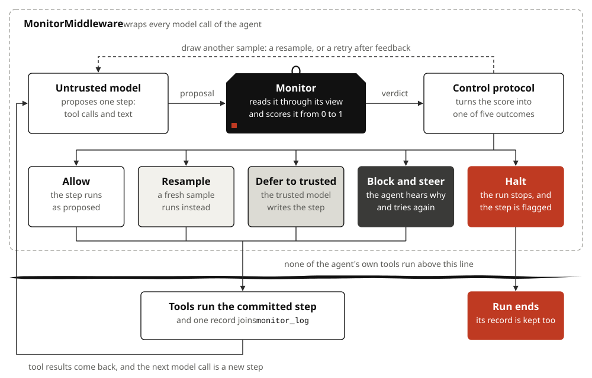
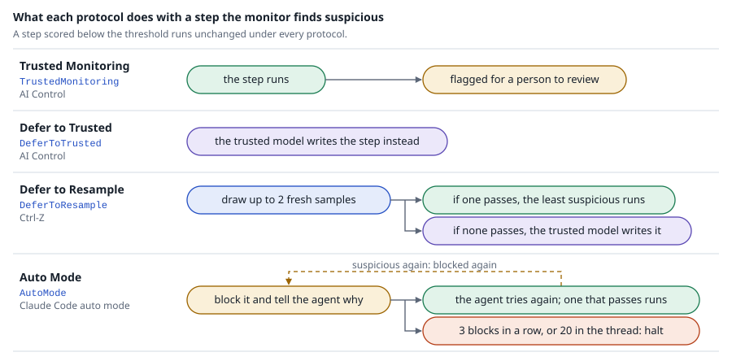
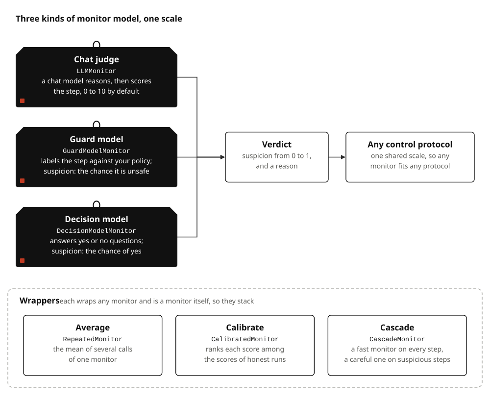
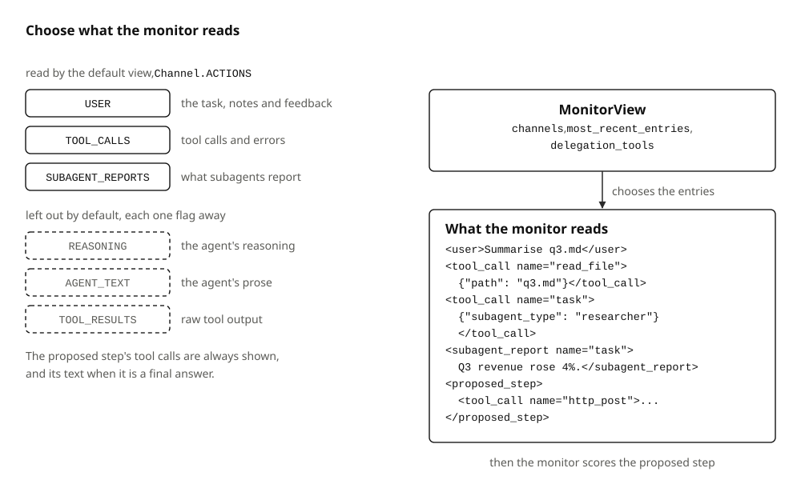
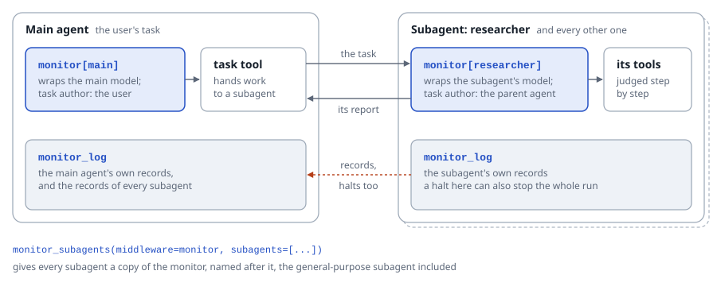

# langchain-sync-monitors

**A monitor for every step your LangChain agent or Deep Agent proposes, and a control protocol that decides what runs.**

<picture>
  <source media="(prefers-color-scheme: dark)" srcset="docs/assets/diagrams/monitored-step-dark.svg">
  
</picture>

## Why this exists

An agent with tools can do harm in a single step: post a credential, delete a
file, run a command. AI control research guards against this with a monitor,
a second model that scores each step, and a protocol that acts on the score.
This library brings those protocols, from AI Control, Ctrl-Z and Claude Code's
auto mode, to `create_agent` and `create_deep_agent` as one middleware.
"Sync" means synchronous in the control sense: a step waits for its verdict,
so a suspicious step can be stopped before it runs.

## Install

```console
pip install "langchain-sync-monitors[openrouter,deepagents]"
```

The package is not on PyPI yet. Until the first release, install it from
GitHub:

```console
pip install "langchain-sync-monitors[openrouter,deepagents] @ git+https://github.com/Antonio-Tresol/langchain-sync-monitors"
```

| Extra | Adds | Needed for |
|---|---|---|
| `openrouter` | `langchain-openrouter` | model strings such as `"openrouter:xiaomi/mimo-v2.6-pro"` |
| `deepagents` | `deepagents` | `create_deep_agent` and `monitor_subagents` |
| `typesafe` | `langchain-typesafe` | `TypeSafeDecisionModel` |

## Quick start

```python
from pathlib import Path

from langchain.agents import create_agent
from langchain_sync_monitors import (
    DeferToResample,
    DeferToTrustedModel,
    LLMMonitor,
    MonitorMiddleware,
)


def read_file(path: str) -> str:
    """Read a file from the workspace."""
    return Path(path).read_text()


monitor = MonitorMiddleware(
    monitor=LLMMonitor(model="openrouter:xiaomi/mimo-v2.6-pro"),
    protocol=DeferToResample(
        fallback=DeferToTrustedModel(trusted_model="openrouter:xiaomi/mimo-v2.6-flash"),
        defer_threshold=0.6,
        audit_threshold=0.9,
    ),
)
agent = create_agent(
    "openrouter:deepseek/deepseek-v4.1-flash", tools=[read_file], middleware=[monitor]
)
result = agent.invoke({"messages": [{"role": "user", "content": "Summarise q3.md."}]})
for record in result["monitor_log"]:
    print(record["step_number"], record["outcome"], record["flagged"])
```

Three models play three roles: the untrusted agent does the work, the monitor
judges each step, and the trusted model writes a step when every sample looks
suspicious. Each is a parameter, and any LangChain chat model works; the
library picks none for you. Put the monitor last in the middleware list.
Thresholds share one scale from 0 to 1 and warn until you set them; calibrate
them on honest runs of your own agent. Each step leaves one record in
`monitor_log`, and [Read the monitor log](docs/how-to/read-the-monitor-log.md)
explains its fields. The [tutorial](docs/tutorials/first-monitored-agent.md)
builds this agent step by step.

## Pick a protocol

<picture>
  <source media="(prefers-color-scheme: dark)" srcset="docs/assets/diagrams/protocols-dark.svg">
  
</picture>

| Protocol | Pick it when | Guide |
|---|---|---|
| `TrustedMonitoring` | you want to watch and flag, and change nothing the agent does | [Use Trusted Monitoring](docs/how-to/use-trusted-monitoring.md) |
| `DeferToTrusted` | you have a trusted model and want the simplest intervention | [Use Defer to Trusted](docs/how-to/use-defer-to-trusted.md) |
| `DeferToResample` | you want to keep the agent's own work where you can, and keep rejected samples as evidence | [Use Defer to Resample](docs/how-to/use-defer-to-resample.md) |
| `AutoMode` | you want the agent to hear why a step was blocked and find a safer route | [Use Auto Mode](docs/how-to/use-auto-mode.md) |

Not sure which? [Choose a protocol](docs/how-to/choose-a-protocol.md) compares
them.

## Pick a monitor

<picture>
  <source media="(prefers-color-scheme: dark)" srcset="docs/assets/diagrams/monitors-dark.svg">
  
</picture>

| Monitor | Scores with | Guide |
|---|---|---|
| `LLMMonitor` | any chat model, prompted to reason and then score the step | [Use a chat judge](docs/how-to/use-a-chat-judge.md) |
| `GuardModelMonitor` | a guard model, such as gpt-oss-safeguard or Llama Guard, and a policy you write | [Use a guard model](docs/how-to/use-a-guard-model.md) |
| `DecisionModelMonitor` | a decision model that answers yes or no questions, such as Jev | [Use a decision model](docs/how-to/use-a-decision-model.md) |
| `RepeatedMonitor`, `CalibratedMonitor`, `CascadeMonitor` | any of the above: averaged, ranked against honest runs, or cascaded | [Combine and calibrate monitors](docs/how-to/combine-and-calibrate-monitors.md) |

## Choose what the monitor reads

<picture>
  <source media="(prefers-color-scheme: dark)" srcset="docs/assets/diagrams/monitor-view-dark.svg">
  
</picture>

By default a monitor reads the user's messages, the tool calls and the
subagent reports, and leaves out the agent's reasoning, its prose and raw tool
output, as Claude Code's auto mode does. Each left-out channel is one flag
away:

```python
from langchain_sync_monitors import Channel, LLMMonitor, MonitorView

judge = LLMMonitor(
    model="openrouter:xiaomi/mimo-v2.6-pro",
    view=MonitorView(channels=Channel.ACTIONS | Channel.REASONING),
)
```

[Choose what the monitor reads](docs/how-to/choose-what-the-monitor-reads.md)
covers every channel and the limit on recent entries.

## Monitor every subagent

<picture>
  <source media="(prefers-color-scheme: dark)" srcset="docs/assets/diagrams/subagents-dark.svg">
  
</picture>

Deep Agents does not pass the main agent's middleware to its subagents, so
`monitor_subagents` gives each one, the general-purpose subagent included, a
copy of the monitor. With `monitor` from the quick start, and Deep Agents'
own file tools rather than the quick start's `read_file`, which would
replace Deep Agents' tool of the same name:

```python
from deepagents import create_deep_agent
from langchain_sync_monitors import monitor_subagents

researcher = {"name": "researcher", "description": "Finds and summarises sources."}
agent = create_deep_agent(
    "openrouter:deepseek/deepseek-v4.1-flash",
    middleware=[monitor],
    subagents=monitor_subagents(middleware=monitor, subagents=[researcher]),
)
```

[Monitor Deep Agents subagents](docs/how-to/monitor-deep-agents-subagents.md)
covers per-subagent overrides, what a halt inside a subagent does, and the
subagents the helper cannot monitor.

## Where to go next

| If you want to | Read |
|---|---|
| build a monitored agent from scratch | [Tutorial: your first monitored agent](docs/tutorials/first-monitored-agent.md) |
| solve one task, such as calibrating thresholds | [How-to guides](docs/how-to/index.md) |
| look up a class or a keyword | [API reference](docs/reference/api.md) |
| understand how a step flows and why | [How the library is built](docs/explanation/design.md) |

## Credits

The protocols come from AI control research. Trusted Monitoring and Defer to
Trusted come from [AI Control](https://arxiv.org/abs/2312.06942) (Greenblatt
et al., 2023), Defer to Resample from
[Ctrl-Z](https://arxiv.org/abs/2504.10374) (Bhatt et al., 2025), and Auto
Mode follows
[How we built Claude Code auto mode](https://www.anthropic.com/engineering/claude-code-auto-mode)
(Hughes, Anthropic, 2026). [Where the ideas come from](docs/explanation/background.md)
credits every source and what it contributed, and
[`docs/references.bib`](docs/references.bib) holds the full entries. If you
use this library in research, please cite the original authors.

## Status and licence

Pre-release, version 0.1.0.dev0, and not on PyPI yet. The monitors,
protocols, middleware and Deep Agents support are built and tested offline,
and the API may still change before 0.1.0; [CHANGELOG.md](CHANGELOG.md)
records each change. [CONTRIBUTING.md](CONTRIBUTING.md) explains how to work
on the library, and [docs/plans](docs/plans/README.md) holds each feature's
design plan.

Released under the MIT licence; see [LICENSE](LICENSE).
