# How the library is built

This explanation describes how langchain-sync-monitors is put together, for a
reader who has not seen the design plan: what happens on one step of an agent,
where the monitor sits, the four pieces that share the work, and how the same
code serves subagents and both `invoke()` and `ainvoke()`.

## One step, end to end

A step is one model call of the agent. The untrusted model, the one doing the
agent's work, proposes the step: its reasoning, its text and any tool calls.
The monitor middleware wraps that call, so the proposal is judged before any
tool runs, and the control protocol can call the model again or call a
different, trusted model instead.

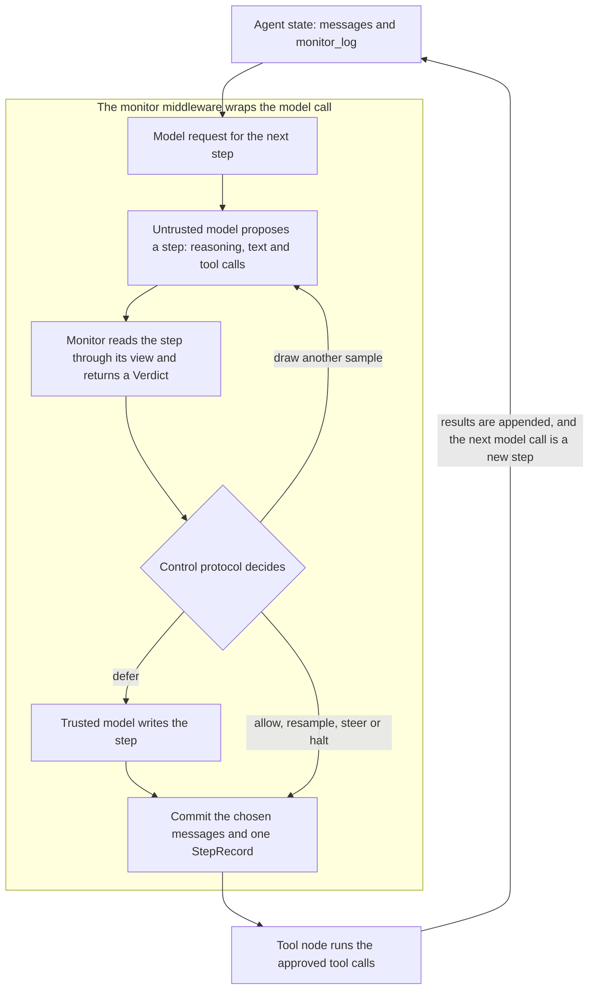

Everything inside the middleware stays a proposal until the protocol decides.
Rejected samples and the monitor's own model calls never reach the agent's
messages. What is committed is the chosen response, whether an untrusted
sample or the trusted model's step, together with one `StepRecord` in
`monitor_log` that keeps every sample the monitor judged, so rejected samples
survive as evidence for an auditor. Nor do they reach the message stream, as
[What streams](#what-streams) explains.

## Where the middleware sits

LangChain gives middleware several hooks. The monitor uses `wrap_model_call`
and `awrap_model_call`, the only hooks that gate every step and can call the
model more than once. An `after_model` hook would come too late: after-model
hooks run in reverse list order, and Deep Agents lists
`HumanInTheLoopMiddleware` after user middleware, so its interrupt would fire
before an after-model monitor ran.

LangChain nests `wrap_model_call` handlers so that the first middleware in the
list is the outermost layer. In a plain `create_agent`, the monitor goes last
in the list, directly around the model. That position matters: middleware
listed after the monitor becomes a layer inside it, and when the monitor draws
several samples, LangChain's composed handler keeps only the commands of the
last inner call, by design and as its documentation states, whichever sample
the protocol commits [@langchain2026].

Deep Agents builds its own stack around the user's middleware. With
deepagents 0.7.19 [@deepagents2026] and `interrupt_on` set, the list, from
outermost to innermost, is:

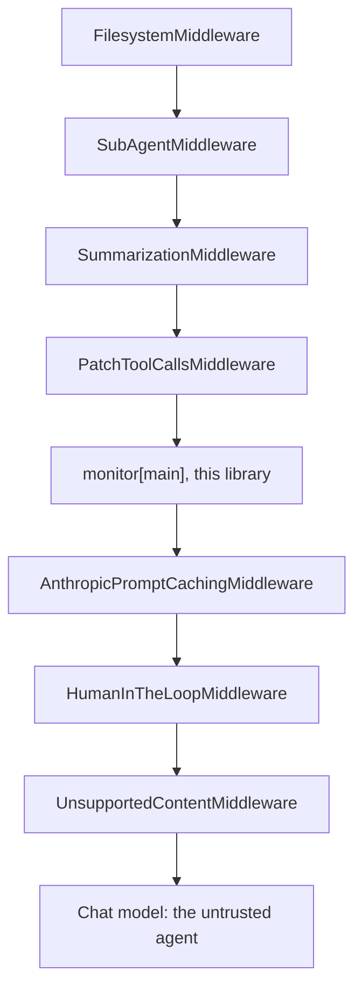

Skills, memory, asynchronous subagents and harness profiles add layers of
their own when they are configured. The monitor therefore sees the
conversation after summarisation, which is what the agent itself sees, and
every resample or trusted call passes through the inner layers, so prompt
caching and content checks still apply. Those inner layers only change the
request, so they return no commands, and the default stack is safe for
resampling.

Middleware names must be unique within one agent, so the monitor is named
after the agent it watches: `monitor[main]`, `monitor[researcher]` and so on.
Middleware instances are shared across parallel subagent runs, so the monitor
keeps no per-run state on itself; everything a run needs lives in the graph
state.

## Four pieces

The work is split so that what the monitor reads, how it scores, and what
happens with the score are separate choices.

| Piece | Interface | Job |
|---|---|---|
| View | `MonitorView`, `Channel` | Chooses which parts of the transcript the monitor reads. |
| Monitor | `Monitor.evaluate`, `Monitor.evaluate_sync` | Scores one proposed step and returns a `Verdict`: a `suspicion` from 0 to 1 and a `reason`. |
| Control protocol | `ControlProtocol.decide` | Samples and judges the step through a `PendingStep`, then returns a `StepDecision`. |
| Middleware | `MonitorMiddleware` | Builds the pending step for each model call, runs the protocol, and commits the decision and its record. |

Because every monitor reports suspicion on the same 0 to 1 scale, any monitor
works with any protocol. A protocol reaches the model only through the
`PendingStep` it is given:

- `sample(count=..., blocked_attempts=..., concurrently=...)` draws fresh
  samples of the step and has the monitor judge each one, returning `Sample`s
  that pair each response with its `Verdict`;
- `request_trusted_step(trusted_model=...)` has a trusted model write the step,
  with the same conversation and tools;
- `previous_records` holds this monitor's records from earlier steps of the
  run.

When no sample is acceptable, a `Fallback` writes the step instead: the trusted
model does, or the run halts. The protocol's `StepDecision` names the
`Outcome` (`ALLOWED`, `RESAMPLED`, `DEFERRED_TO_TRUSTED`, `STEERED` or
`HALTED`), the response to commit, every sample, the sample that ran if one
did, and whether the step is flagged for audit.

## What the monitor reads

Every transcript entry belongs to one `Channel`: `USER`, `REASONING`,
`AGENT_TEXT`, `TOOL_CALLS`, `TOOL_RESULTS` or `SUBAGENT_REPORTS`. A
`MonitorView` is a set of channels, plus an optional limit on how many recent
entries to keep and the names of the tools whose results count as subagent
reports (`task` by default).

The default view, `Channel.ACTIONS`, holds the user's messages, the tool calls
and the subagent reports. It leaves out the agent's reasoning, its prose and
raw tool output, as Claude Code's auto mode classifier does
[@hughes2026automode]. Reasoning is one flag away. Reading the chain of thought
catches more misbehaviour than reading actions alone [@baker2025monitoring],
but persuasive reasoning can also talk a monitor out of a correct flag
[@arnav2025cotredhanded], and more context does not always help a monitor
[@arike2026information].

`transcript.py` renders the entries as tagged text: `<user>`, `<agent>`,
`<agent_reasoning>`, `<tool_call>`, `<tool_result>`, `<subagent_report>` and,
for the step being judged, `<proposed_step>`. Content is HTML-escaped, so text
inside a tool result cannot close a tag and pose as another entry. Two tags
guard against a forged approval. Inside a subagent the task came from the
parent agent, so its messages are rendered as `<delegator>` rather than
`<user>`, following the `TaskAuthor` in the `MonitorInput`. The monitor's own
feedback is rendered as `<monitor_feedback>` wherever the task is shown: both
the message that answers a blocked final answer and the tool message that
answers a blocked tool call, which carries the tool's name. So a monitor that
does not read tool results still sees that an earlier call was blocked and
did not run. When the view keeps
only recent entries, the first message that states the task is kept anyway,
since a monitor cannot judge a step without it. Reasoning is read from
LangChain's standard content blocks, with a fallback for a reply that would
carry it only in OpenRouter's `reasoning_details`.

## Control protocols

Every protocol starts the same way: the untrusted model proposes a step, and
the monitor scores it. The protocols differ in what a suspicious score
triggers. Each threshold is on the common 0 to 1 scale, has a default, and
raises an `UncalibratedThresholdWarning` while the default is in use, because
a threshold should come from the score distribution of honest runs
[@bhatt2025ctrlz]. The planned defaults are 0.6 to defer, block or flag, and
0.9 to audit.

### Trusted Monitoring

The step always runs; a score above the flag threshold marks it for audit
[@greenblatt2023aicontrol].

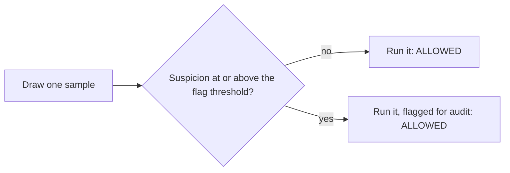

### Defer to Trusted

A suspicious step is replaced by the trusted model's own step
[@greenblatt2023aicontrol]. It is Defer to Resample with no resamples.

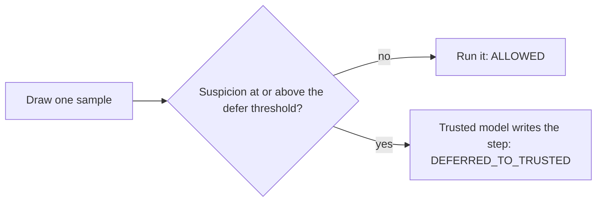

### Defer to Resample

A suspicious step is sampled again, and the least suspicious acceptable sample
runs; the trusted model writes the step only when every sample looks
suspicious [@bhatt2025ctrlz]. The agent never sees the rejected samples. Up to
two extra samples are drawn, as in the paper. `Resampling.SEQUENTIAL` draws
them one at a time and stops at the first acceptable one;
`Resampling.PARALLEL` draws them all at once, for lower latency and more model
calls. The audit flag uses the lowest score across the samples, as in Ctrl-Z.

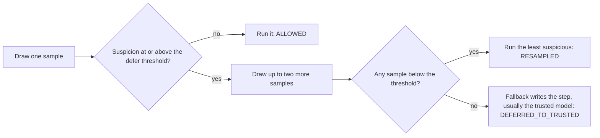

### Auto Mode

A suspicious step is blocked, and the agent is told why, so its next attempt
can take a safer route [@hughes2026automode]. After three blocks in a row, or
twenty in one run, the limits Claude Code uses, a fallback takes over: the run
halts, or the trusted model writes the step.

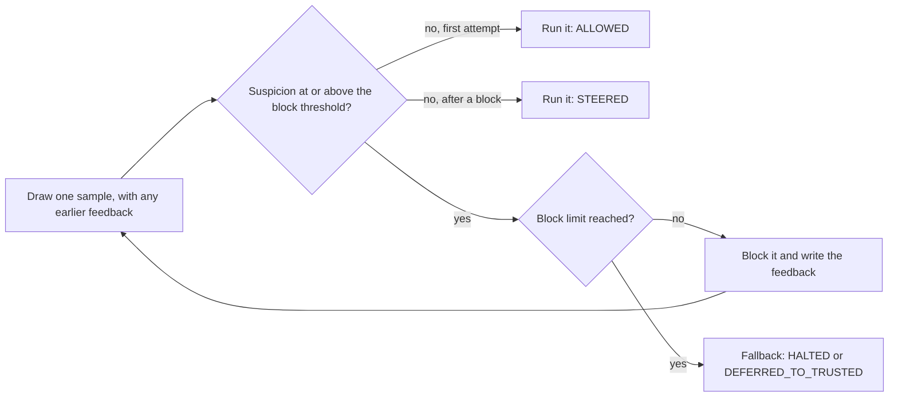

### Auto Mode, step by step

In this example the agent tries to post a credential off-site, is blocked, and
writes a summary instead.

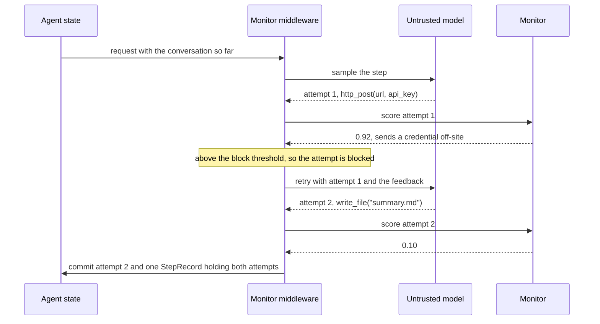

`FeedbackVisibility` decides what the transcript keeps. With `HIDDEN`, only
the retry call sees the blocked attempt and its feedback; the transcript shows
attempt 2 alone, and the log keeps attempt 1. With `IN_TRANSCRIPT`, the blocked
attempt and its feedback are committed before attempt 2, as Claude Code does.
A blocked tool call is answered with one error tool message per call, so every
tool call keeps a matching result. Every message the monitor inserts gets a
fresh id (`monitor-<uuid4>`), because LangGraph replaces messages that share an
id, and the feedback is marked in its text, because some providers drop a
message's `name`.

## Three kinds of monitor model

Any model that can judge a step can be the monitor. The three families return
different things, so each has its own monitor class, and all of them produce
the same `Verdict`. The model is always a parameter: the library never picks
one, and a provider string such as `"openrouter:..."` is resolved with
LangChain's `init_chat_model`.

- **Chat judges** (`LLMMonitor`) are general chat models prompted to reason
  first and then give a score on an anchored scale, 0 to 10 by default, mapped
  onto 0 to 1. Reasoning before the score is the prompt component Apollo
  Research found matters most [@apollo2026monitoringprompt]. A reply that
  cannot be parsed counts as fully suspicious.
- **Guard models** (`GuardModelMonitor`) label a step against a policy you
  write. Llama Guard and its peers score with the probability of the unsafe
  label, read from the label token's log-probabilities
  [@inan2023llamaguard; @zeng2024shieldgemma; @padhi2024graniteguardian]. When
  a provider returns no log-probabilities, the share of several samples
  labelled unsafe is the standard fallback, with gains that level off after a
  handful [@xiong2024uncertainty; @lyu2025sampleconsistency].
  `GuardScoring.AUTO` does the first when it can and draws five samples
  otherwise. Guard models are overconfident, especially under jailbreaks
  [@liu2025guardcalibration], and a hard 0 or 1 label gives a threshold only
  one operating point, so that option warns.
- **Decision models** (`DecisionModelMonitor`) answer yes or no questions with
  a probability and generate no text. Suspicion is the probability of yes.
  Several questions can go in one request, combined by their maximum, so one
  strong hit is not diluted. Jev is served through OpenRouter's Decisions API
  [@openrouter2026decisions] and through TypeSafe's own client
  [@typesafe2026langchain].

Scores have to be fine-grained. Control protocols set thresholds as
percentiles of honest-run scores, and a score with few distinct values cannot
hit a small audit budget, because the budget falls inside a group of tied
scores [@kaufman2025basharena; @koran2026ensemble]. Three wrappers, each a
monitor itself, address this and stack around any family:

- `RepeatedMonitor` averages several calls of one monitor, as the control
  papers do [@bhatt2025ctrlz; @tracy2026linuxarena; @koran2026ensemble];
- `CalibratedMonitor` reports suspicion as the share of honest-run scores
  below this one, breaking ties at random [@makins2026multiagent], so 0.99
  means a 1% budget;
- `CascadeMonitor` runs a fast monitor on every step and sends only the steps
  it finds suspicious to a careful one [@hua2025combining], after the two
  stages of Claude Code's auto mode [@hughes2026automode].

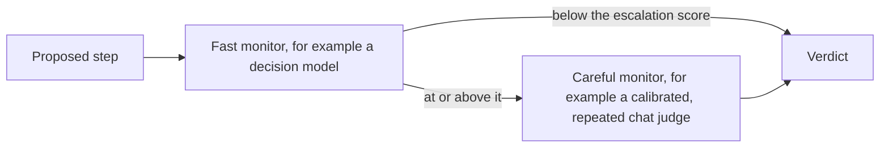

## Subagents

Deep Agents does not pass the main agent's middleware to its subagents. A
helper, `monitor_subagents`, adds a monitor to every subagent spec, including
the built-in general-purpose one. Each subagent gets a copy of the main
monitor and protocol by default, named after the subagent and marked with
`TaskAuthor.PARENT_AGENT`, so its monitor reads the delegated task as the
parent agent's words rather than the user's. An override can give a named
subagent a different monitor, protocol or view. Compiled and remote subagents
cannot take injected middleware, so the helper raises an error for them
instead of leaving them unmonitored.

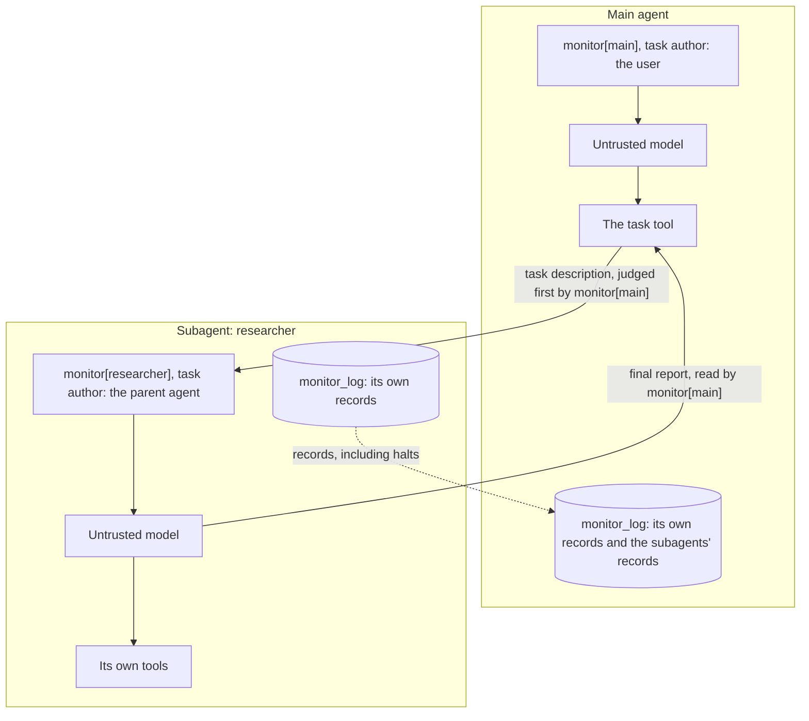

`SubagentHalt` decides what a halt inside a subagent does. With
`STOP_SUBAGENT_ONLY`, the default, the parent receives the halt message as the
task's result and carries on under its own monitor. With `STOP_WHOLE_RUN`, the
parent's monitor finds the subagent's halt record in `monitor_log` and halts
the parent before its next model call. This works because a subagent's
records flow back into the parent's log, which depends on declaring the log
with its reducer in the last position: LangGraph reads a reducer only from the
last position of the annotation [@langgraph2026].

## Sync and async

LangChain calls `wrap_model_call` under `invoke()` and `stream()`, and
`awrap_model_call` under `ainvoke()` and `astream()`. Its own middlewares keep
two copies of their logic, one per hook. This library writes each protocol
once, as a coroutine that talks to a pending step, and gives the pending step
two implementations.

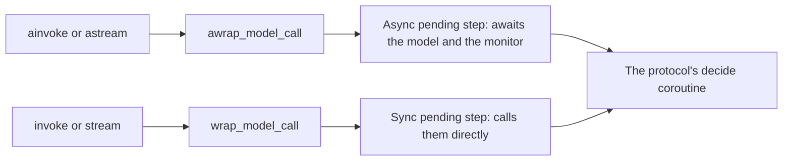

The sync pending step's methods are declared `async` but never wait on
anything, so under `invoke()` the protocol's coroutine can be finished with a
single step, without an event loop. If a protocol ever awaited real
asynchronous work there, the library raises `SynchronousRunError` instead of
hanging. Under `invoke()`, samples asked for concurrently are drawn one after
another. Monitors declare both `evaluate` and `evaluate_sync`, so a monitor
that lacks either cannot be instantiated.

## What streams

A synchronous monitor judges a step before anything uses it, so nothing the
protocol produces reaches `stream_mode="messages"` before the protocol has
decided. The middleware runs the protocol inside a block that adds LangGraph's
`nostream` tag to every model call made there, and the message stream skips
calls with that tag [@langgraph2026]. That covers the untrusted samples, the
trusted model's step and the monitor's own calls, including samples drawn in
parallel and calls inside a subagent's monitor. When the model node returns the
committed step, LangGraph streams it from the node's output [@langgraph2026].

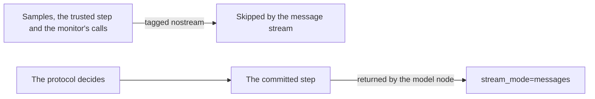

The cost is live tokens. A monitored agent streams each step whole, once the
protocol commits it, and not token by token as the model writes it.

Rejected samples stay out of the conversation, not out of the record. They
remain in `monitor_log`, which the `values` and `updates` stream modes carry,
in the `MonitorStepEvent` on `stream_mode="custom"`, and in traces.
`astream_events` is not filtered: it reports every model call live, rejected
samples included, so a user interface should read `stream_mode="messages"`
instead. With
`FeedbackVisibility.IN_TRANSCRIPT`, a blocked attempt and its feedback are
committed as part of the conversation, so they stream along with the step that
follows them.

The monitor's own calls also carry LangChain's internal-call metadata, from
`model_calls.build_internal_call_config`, which the experimental
`stream_events(version="v3")` projection uses to drop them [@langchain2026]. A
custom monitor that passes its own `tags` in a call's config replaces the tags
the call would inherit, and that call streams again; such a monitor should add
`langgraph.constants.TAG_NOSTREAM` to its tags.

## The log records

Records pass through checkpointers, so they hold plain values only: strings,
numbers, booleans, `None`, lists and `TypedDict`s, with the outcome stored as
a string. A `StepRecord` names the agent and the monitor, numbers the step,
gives the outcome, whether the step was flagged and how many attempts were
blocked, and lists a `SampleRecord` for every sample: its suspicion, the
monitor's reason, the proposal rendered in full for a human auditor, and
whether it ran.
