# How the library is built

This explanation describes how langchain-sync-monitors is put together, for a
reader who has not seen the design plan: what happens on one step of an agent,
where the monitor sits, the four pieces that share the work, and how the same
code serves subagents and both `invoke()` and `ainvoke()`.

## One step, end to end

A step is one model call of the agent. The untrusted model, the one doing the
agent's work, proposes the step: its reasoning, its text and any tool calls.
The monitor middleware wraps that call, so the proposal is judged before any
tool runs, and the control protocol can call the model again or call a
different, trusted model instead.

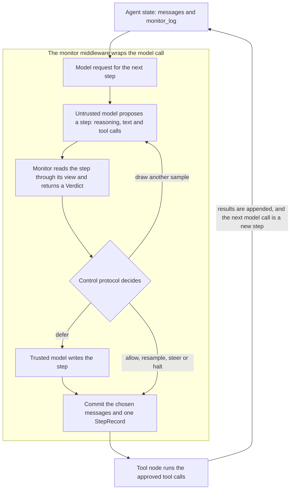

Everything inside the middleware stays a proposal until the protocol decides.
Rejected samples and the monitor's own model calls never reach the agent's
messages. What is committed is the chosen response, whether an untrusted
sample or the trusted model's step, together with one `StepRecord` in
`monitor_log` that keeps every sample the monitor judged, so rejected samples
survive as evidence for an auditor. Nor do they reach the message stream, as
[What streams](#what-streams) explains.

## Where the middleware sits

LangChain gives middleware several hooks. The monitor uses `wrap_model_call`
and `awrap_model_call`, the only hooks that gate every step and can call the
model more than once. Its `after_model` hook judges nothing; it only ends the
run after a halted step, as [Halts, fallbacks and failed
steps](#halts-fallbacks-and-failed-steps) explains. An `after_model` hook would come too late: after-model
hooks run in reverse list order, and Deep Agents lists
`HumanInTheLoopMiddleware` after user middleware, so its interrupt would fire
before an after-model monitor ran.

LangChain nests `wrap_model_call` handlers so that the first middleware in the
list is the outermost layer. In a plain `create_agent`, the monitor goes last
in the list, directly around the model. That position matters: middleware
listed after the monitor becomes a layer inside it, and when the monitor draws
several samples, LangChain's composed handler keeps only the commands of the
last inner call, by design and as its documentation states, whichever sample
the protocol commits [@langchain2026].

Deep Agents builds its own stack around the user's middleware. With
deepagents 0.7.19 [@deepagents2026] and `interrupt_on` set, the list, from
outermost to innermost, is:

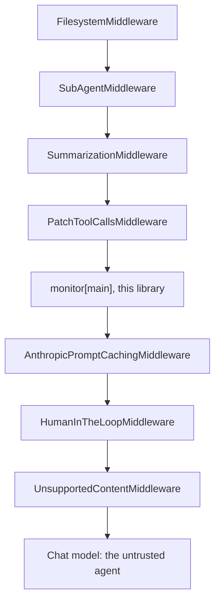

Skills, memory, asynchronous subagents and harness profiles add layers of
their own when they are configured. The monitor therefore sees the
conversation after summarisation, which is what the agent itself sees, and
every resample or trusted call passes through the inner layers, so prompt
caching and content checks still apply. Those inner layers only change the
request, so they return no commands, and the default stack is safe for
resampling.

Middleware names must be unique within one agent, so the monitor is named
after the agent it watches: `monitor[main]`, `monitor[researcher]` and so on.
Middleware instances are shared across parallel subagent runs, so the monitor
keeps no per-run state on itself; everything a run needs lives in the graph
state.

### Two monitors in one agent

A second `MonitorMiddleware` in the list, with its own `label`, sits inside
the first: the outer monitor judges the step the inner one commits. The inner
monitor returns its record as a command, and LangChain keeps only the commands
of the last call of the outer monitor's handler, or piles up those of calls
made at once [@langchain2026]. The inner protocol does not change this, so
the outer protocol decides whether the inner records are sound:

| Outer protocol | Inner monitor's records |
|---|---|
| `TrustedMonitoring` | Sound |
| `DeferToResample(max_resamples=0, fallback=HaltRun())` | Sound |
| `AutoMode` with `max_consecutive_blocks=1` or `max_total_blocks=1`, and `when_limit_reached=HaltRun()` | Sound |
| `DeferToTrusted`, or `DeferToResample` with resamples or with `DeferToTrustedModel` | The judgement of each rejected sample is lost |
| `AutoMode` that can block twice in a step, or with `DeferToTrustedModel` | The judgement of each blocked sample is lost |
| `DeferToResample(resampling=Resampling.PARALLEL)` under `ainvoke()` | The first sample's judgement is lost, and the resamples drawn at once leave one record each under the same step number, so later numbers are skipped; if the trusted model then writes the step, only its record is kept |

The first three call the model at most once per step. Sound means the stack
loses nothing of its own: as with one monitor, a middleware outside it that
raises after a step returns leaves that step's records on
`stream_mode="custom"` but out of `monitor_log`. Whatever the outer protocol,
an inner monitor whose protocol blocks, such as `AutoMode`, must keep
`FeedbackVisibility.HIDDEN`: with `IN_TRANSCRIPT` it commits its blocked
attempts ahead of the step, and the outer monitor judges the first blocked
proposal instead of the step that runs. In a sound stack each record holds its
own monitor's decision, so when the outer monitor halts a step the inner one
allowed, the inner record still marks its sample `executed` though nothing
ran, and only the outer record says what ran. `check_monitor_placement` warns
about each stack that loses or misjudges records, and about a middleware
between two monitors inside one that can call the model again;
`monitor_subagents` warns about the stacks it builds.

To judge every sample with two monitors under a protocol that resamples, give
one `MonitorMiddleware` a monitor that runs both and keeps the higher
suspicion, so either can reject the step. The library has no such wrapper, and
a few lines make one:

```python
from langchain_sync_monitors import Monitor, MonitorInput, Verdict


class HigherSuspicion(Monitor):
    """Judge with both monitors and keep the more suspicious verdict."""

    def __init__(self, *, first: Monitor, second: Monitor) -> None:
        self.first = first
        self.second = second

    async def evaluate(self, monitor_input: MonitorInput) -> Verdict:
        verdicts = [
            await self.first.evaluate(monitor_input),
            await self.second.evaluate(monitor_input),
        ]
        return max(verdicts, key=lambda verdict: verdict.suspicion)

    def evaluate_sync(self, monitor_input: MonitorInput) -> Verdict:
        verdicts = [
            self.first.evaluate_sync(monitor_input),
            self.second.evaluate_sync(monitor_input),
        ]
        return max(verdicts, key=lambda verdict: verdict.suspicion)
```

`CascadeMonitor` does not do this. It calls the careful monitor only when the
fast one finds the step suspicious, and the careful verdict then replaces the
fast one, so the careful monitor can clear a step the fast one flagged.

## Four pieces

The work is split so that what the monitor reads, how it scores, and what
happens with the score are separate choices.

| Piece | Interface | Job |
|---|---|---|
| View | `MonitorView`, `Channel` | Chooses which parts of the transcript the monitor reads. |
| Monitor | `Monitor.evaluate`, `Monitor.evaluate_sync` | Scores one proposed step and returns a `Verdict`: a `suspicion` from 0 to 1 and a `reason`. |
| Control protocol | `ControlProtocol.decide` | Samples and judges the step through a `PendingStep`, then returns a `StepDecision`. |
| Middleware | `MonitorMiddleware` | Builds the pending step for each model call, runs the protocol, and commits the decision and its record. |

Because every monitor reports suspicion on the same 0 to 1 scale, any monitor
works with any protocol. A protocol reaches the model only through the
`PendingStep` it is given:

- `sample(count=..., blocked_attempts=..., concurrently=...)` draws fresh
  samples of the step and has the monitor judge each one, returning `Sample`s
  that pair each response with its `Verdict`;
- `request_trusted_step(trusted_model=...)` has a trusted model write the step,
  with the same conversation and tools;
- `previous_records` holds this monitor's records from earlier steps of the
  thread, every turn of a checkpointed thread included, or, inside a
  subagent, of its current delegation;
- `blocks_in_thread` counts the blocks this monitor recorded in the
  conversation thread before the step, subagents included, except those of a
  subagent whose run raised, and `new_subagent_blocks` the ones recorded
  inside subagents since the agent's last step.

When no sample is acceptable, a `Fallback` writes the step instead: the trusted
model does, or the run halts. The protocol's `StepDecision` names the
`Outcome` (`ALLOWED`, `RESAMPLED`, `DEFERRED_TO_TRUSTED`, `STEERED` or
`HALTED`), the response to commit, every sample, the sample that ran if one
did, and whether the step is flagged for audit.

## What the monitor reads

Every transcript entry belongs to one `Channel`: `USER`, `REASONING`,
`AGENT_TEXT`, `TOOL_CALLS`, `TOOL_RESULTS` or `SUBAGENT_REPORTS`. A
`MonitorView` is a set of channels, plus an optional limit on how many recent
entries to keep and the names of the tools whose results count as subagent
reports (`task` by default).

The default view, `Channel.ACTIONS`, holds the user's messages, the tool calls
and the subagent reports, together with the context notes, tool errors and
monitor feedback described below; their text is escaped and authorises
nothing. It leaves out the agent's reasoning, its prose and
raw tool output, as Claude Code's auto mode classifier does
[@hughes2026automode]. Reasoning is one flag away. Reading the chain of thought
catches more misbehaviour than reading actions alone [@baker2025monitoring],
but persuasive reasoning can also talk a monitor out of a correct flag
[@arnav2025cotredhanded], and more context does not always help a monitor
[@arike2026information].

`transcript.py` renders the entries as tagged text: `<user>`, `<agent>`,
`<agent_reasoning>`, `<tool_call>`, `<tool_result>`, `<subagent_report>` and,
for the step being judged, `<proposed_step>`. Content is HTML-escaped, so text
inside a tool result cannot close a tag and pose as another entry. The view
selects what the monitor reads of the history; the step being judged always
shows its tool calls, whatever the view, because they are the action the
protocol gates.

A provider's built-in tools, such as Anthropic's web fetch or OpenAI's web
search, run at the provider inside the model call, so they have run before the
monitor sees the step. LangChain's translators give them as standard
`server_tool_call` and `server_tool_result` blocks for Anthropic, OpenAI's
Responses API and Gemini's code execution, and a reply in LangChain's own
standard blocks already holds them [@langchaincore2026]. The monitor renders
each call as `<provider_tool_call>` beside the tool calls and each result as
`<provider_tool_result>` beside the tool results. Gemini's Google Search leaves
its queries only in the reply's `grounding_metadata`, so the monitor renders
those queries as a `<provider_tool_call name="grounding">` and the sources
found as its result. A block LangChain cannot map, such as one in a reply
without `model_provider` in its metadata, is rendered whole as
`<unrecognised_block>` beside the tool calls, so it is shown rather than
dropped. A block of reasoning, such as Anthropic's `thinking`, sits beside
the reasoning instead, so a view without reasoning still leaves it out, and
a block that repeats one of the message's tool calls is not shown twice. Other searches that leave no block stay invisible: Gemini's URL
context, whose metadata langchain-google-genai does not keep, and the search
annotations of OpenAI's Chat Completions or OpenRouter's web plugin.

The judge always reads the provider tool calls of the step it judges. Their
results sit in `TOOL_RESULTS`, so under the default view it reads the call and
not what it returned. The audit record keeps both, the result in full. A suspicious score
still decides what happens to the rest of the step, but a synchronous monitor
cannot stop a call that has already run. It runs once for every sample drawn,
so each resample of Defer to Resample and each retry of Auto Mode runs it
again, in samples that are then rejected too.

Only the task author's own words authorise an action, so three kinds of entry
guard against a forged approval:

- Inside a subagent the task came from the parent agent, so its messages are
  rendered as `<delegator>` rather than `<user>`, following the `TaskAuthor`
  in the `MonitorInput`.
- Only the human messages that arrive untagged as a run's input are the task
  author's, and every other human message is rendered as
  `<context_note source="...">` in the `USER` channel; the prompt says a note
  authorises nothing. Some writers tag their messages with `lc_source`:
  LangChain's and Deep Agents' summaries are tagged `summarization`, and Deep
  Agents' rubric grader `rubric_grader` [@langchain2026; @deepagents2026].
  Others do not: Deep Agents' `read_file` attaches a video's frames in a human
  message whose text holds the path the agent chose, and its Nemotron profile
  writes named nudges [@deepagents2026]. Deep Agents also writes its summary
  with the agent's own model, so in both cases the untrusted model must not be
  able to speak as the user.

  So the monitor records, in the graph state, which human messages were a
  run's input. A `before_agent` hook records each untagged human message the
  monitor has not seen before. A `before_model` hook, each commit and an
  `after_agent` hook record every untagged human message then in the state as
  seen, and write each one that is not a run's input back, by its id, tagged
  as a note named after its `name`, or else `application`. The tag is thus
  part of the message, and a history the application saves or replays keeps
  it. The monitor's `wrap_tool_call` tags the new human messages a tool
  writes where they are written, with the tool's name as their source,
  whether the tool returns a `Command`, a list of commands and tool
  messages, or messages as dictionaries, and whether a command's update is
  a dict, pairs of key and value, a dataclass, a pydantic model or another
  shape LangGraph accepts [@langgraph2026]. A dict comes back a dict, and
  any other update as the pairs LangGraph writes. A command the tool raises
  for the graph as a `ParentCommand`, itself or from a graph it calls, is
  relabelled the same way before it goes on. A message a tool writes
  back wholly unchanged, with the id of one already in the state, as a tool
  that rewrites the history does, keeps its author. One the tool changed in any
  field does not, its metadata included, since metadata can change what a
  message says: Deep Agents' `FilesystemMiddleware` shows a human message
  that carries `additional_kwargs["lc_evicted_to"]` as a stub that names
  that path [@deepagents2026]. A tool that edits a message by id thus writes
  a note named after the tool, so it cannot put the agent's words in the
  user's.
  Before a monitor judges a step, every untagged
  human message whose id is not recorded as input is tagged as a note in the
  monitor's copy of the model request, which can hold messages the state
  lacks. The two lists and the flag below are private state, so a subagent
  starts with none of them and returns none of them. A run's result leaves
  them out too, though `stream_mode="values"`, `stream_mode="updates"` and
  `get_state` show them.

  A run can stop before its end: a model, monitor or fallback call raises,
  it hits its recursion limit, the client stops reading its stream or
  cancels the task that awaits it, a server times it out, or the
  application answers an interrupt with new input rather than a resume. The
  agent can bring such a stop about itself, for example with a step too
  large for the judge's context, which makes the judge's call raise. A fork
  from a checkpoint inside a run is in the same position. Messages written
  after the monitor's last look may then sit in the state unseen, and the
  monitor cannot tell them from the new input. So a private flag is set when
  a run and each of its steps start, and cleared when the run reaches the
  monitor's `after_agent` hook. A run that starts while it is set records no
  input: it tags every new human message as a note from `unconfirmed_input`
  and logs a warning that names their ids. That includes the user's own new
  message, which stays such a note for the rest of the thread, and an entry
  limit may drop it. The runs after it are read normally. A final answer, a
  halt, a structured response and a `return_direct` tool all end at
  `after_agent`, so they leave the flag clear.

  The prompt tells the judge that such a note may be the user's own words:
  it authorises nothing, and only a limit it sets that narrows what the
  agent may do still applies. Honouring such a limit from a message of
  unknown author can block honest work, but it lets no action through. A
  "limit" that drops a safeguard, such as "do not ask me first", would widen
  what passes instead, so the prompt adds that a note never removes a
  safeguard, such as asking the user first, logging or reporting.

  Such a note need not hold the user's words. A `before_model` hook of a
  middleware listed after the monitor runs after the monitor's own, and Deep
  Agents lists a harness profile's middleware there [@deepagents2026]. A
  nudge such a hook writes just before a model call that fails is one the
  monitor never saw, so the next run reads it as `unconfirmed_input` rather
  than as a note named after the nudge. Deep Agents' Nemotron nudge that
  tells the agent to call a tool instead of asking for another confirmation
  becomes such a note, and it opens by saying the user is asking for an
  action. The agent can cause the stop, and the judge is then told that
  this text may be the user's. So the agent gains from the stop only if the
  judge departs from the prompt, by taking an approval from the note or by
  letting it lift a safeguard; the prompt forbids both but cannot guarantee
  either.
- The monitor's own feedback carries `lc_source="monitor"` and is rendered as
  `<monitor_feedback>` wherever the task is shown: both the message that
  answers a blocked final answer and the tool message that answers a blocked
  tool call, which carries the tool's name. So a monitor that does not read
  tool results still sees that an earlier call was blocked and did not run.

Any other tool message with `status="error"` says that a call failed or did not
run: a person rejected it through `HumanInTheLoopMiddleware`, with their reason
[@langchain2026]; the tool does not exist; or the tool raised. It is rendered as
`<tool_error name="...">` in the `TOOL_CALLS` channel, beside the call, so
every view that shows the call also shows that it did not complete, and why.
A tool call whose arguments could not be parsed lands in the message's
`invalid_tool_calls`. It never runs, but it is rendered as
`<malformed_tool_call name="...">` with its raw argument text, in the
transcript, in the proposed step and in the audit record. When a protocol
blocks such a step, the feedback answers each malformed call with an error
result too, because OpenAI-compatible providers receive it as an ordinary tool
call and reject a request that leaves it unanswered.

These tags rest on trust in the application's own middleware. Only the
monitor writes its two sources: the model node writes its feedback, and the
start of a run writes the `unconfirmed_input` notes. So a message a tool writes
loses an `lc_source` of `monitor` or `unconfirmed_input`, and a human message
becomes a note named after the tool. A tool, or a middleware's message, named
after either source writes an `application` note instead. A middleware can
still set either tag on a message it writes, and the monitor then reads it as
its own feedback or as unconfirmed input. Middleware code is trusted here, as
it is everywhere else in the agent. What the monitor distrusts is the content that code carries, such as a
web page, a file or an argument the agent chose, which is escaped and never
read as a tag.

Telling a run's input from the rest still has two open paths, both through
the hooks of a middleware listed before the monitor. Such a message can carry
the agent's own words, as Deep Agents' final answer guard quotes a value the
agent chose [@deepagents2026]. The two paths are these:

- A `before_agent` hook of a middleware listed before the monitor runs before
  the monitor's own, so an untagged human message it writes counts as the
  run's input.
- An `after_agent` hook of a middleware listed before the monitor runs after
  the monitor's own, since LangChain runs `after_agent` hooks in reverse list
  order [@langchain2026]. An untagged human message it writes, without
  sending the run back to the model, counts as the next run's input.

No sound fail-closed rule covers them. At the start of a run such a message
and the new input are both unseen, both are untagged, and both follow the
last message the monitor saw, so the only rule that would close these paths
reads every new message as a note in every run. A history replayed without a
checkpointer holds the tags the monitor wrote, so there only a message the
monitor never saw reads as input, such as one from these two paths or one a
later middleware wrote just before a step that failed. A thread started before
the monitor was added has the gap for every untagged human message it holds,
and so does a human message an application adds with `update_state` between
two finished runs, which is the application speaking. The other way round, a
human message added to a run that resumes, through `Command(update=...)` or
`update_state`, is never recorded as input, so it is a note from
`application`. That fails closed, but a restriction the user adds that way,
such as "do not send anything", then carries no authority with the judge
either; send it as the input of a new run instead.

When the view keeps only recent entries, every message from the task author is
kept anyway, in order: the first states the task, and a later one can narrow or
revoke it. A context note is never kept in their place. After summarisation has
replaced the earlier messages of the model request, the original task may be
gone from what the monitor reads, and the summary is left as a note. Reasoning
is read from LangChain's standard content blocks, with a fallback for a reply
that would carry it only in OpenRouter's `reasoning_details`
[@langchaincore2026; @langchainopenrouter2026].

## Control protocols

Every protocol starts the same way: the untrusted model proposes a step, and
the monitor scores it. The protocols differ in what a suspicious score
triggers. Each threshold is on the common 0 to 1 scale, has a default, and
raises an `UncalibratedThresholdWarning` while the default is in use, because
a threshold should come from the score distribution of honest runs
[@bhatt2025ctrlz]. The defaults are 0.6 to defer, block or flag, and 0.9 to
audit.

A flag is a mark in `monitor_log` for a person to review after the fact. It
never blocks a step: by the time anyone reads the log, the step has run or
been replaced. So Defer to Resample and Defer to Trusted accept an audit
threshold below the defer threshold, which flags steps that still ran, a
review queue of borderline steps. `audit_threshold=None` turns their flagging
off, except that `HaltRun` flags every step it halts.

### Trusted Monitoring

The step always runs; a score at or above the flag threshold marks it for
audit [@greenblatt2023aicontrol].

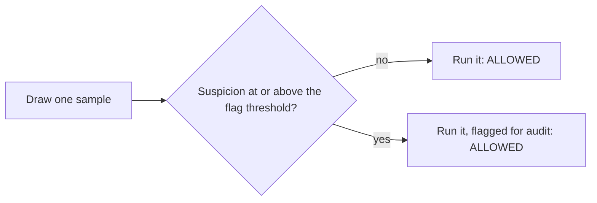

### Defer to Trusted

A suspicious step is replaced by the trusted model's own step
[@greenblatt2023aicontrol]. It is Defer to Resample with no resamples.

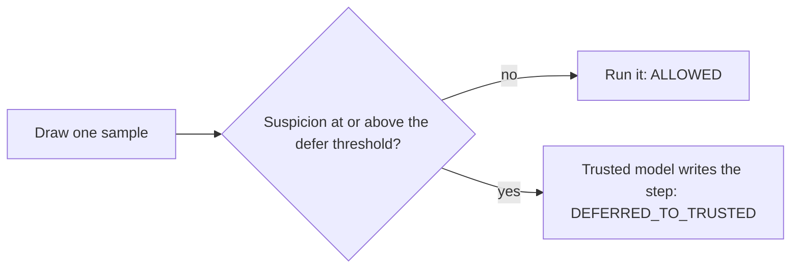

### Defer to Resample

A suspicious step is sampled again, and the least suspicious acceptable sample
runs; the trusted model writes the step only when every sample looks
suspicious [@bhatt2025ctrlz]. The agent never sees the rejected samples. Up to
two extra samples are drawn, as in the paper. `Resampling.SEQUENTIAL` draws
them one at a time and stops at the first acceptable one;
`Resampling.PARALLEL` draws them all at once, for lower latency and more model
calls. The audit flag uses the lowest score across the samples, as in Ctrl-Z.
Resampling needs fresh draws: the more deterministic the model, the less it
helps [@bhatt2025ctrlzpost]. A LangChain response cache, global or on the
agent's model, answers every resample with the first sample again, so the
library warns once with a `CachedResampleWarning` when a step is resampled
under one; build the untrusted model with `cache=False`.

Running the least suspicious sample has a cost against prompt injection. An
agent can write text aimed at the monitor into its step, and an injection that
fools the monitor only some of the time gets another try with every sample, so
resampling turns it into a best-of-n attack [@terekhov2025adaptive]. An
injection that passes one sample in five gets through about half the time
across three samples.

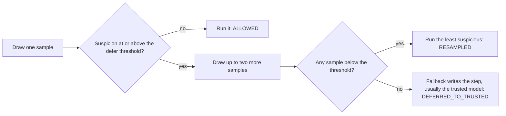

### Auto Mode

A suspicious step is blocked, and the agent is told why, so its next attempt
can take a safer route [@hughes2026automode]. After three blocks in a row, or
twenty in one conversation thread, the limits Claude Code uses within a
session, a fallback takes over: the run halts, or the trusted model writes the
step. The total counts the monitor's blocks in the thread's `monitor_log`,
where each subagent's records arrive when it returns, so delegating again does
not reset it. A subagent starts from the thread's total, so it reaches the
limit where the thread does, and when blocks inside subagents leave the thread
at or over the total, the parent's next step goes to the fallback without
being sampled. The total spans every turn of a checkpointed thread, not one
run, and never resets, so once a thread has reached it, the first block of
every later step goes to the fallback.

The total misses one kind of block: those inside a subagent whose run raises,
because a subagent's records reach its parent only in the result of the call
that started it, and a call that raises has no result. They count when the
failed run is resumed from its checkpoint with `None` as input, since the
subagent then resumes from its own checkpoint. They never count when the
thread goes on with new input, or when a middleware such as LangChain's
`ToolRetryMiddleware` or `ToolErrorMiddleware` answers the failed call with an
error message or runs it again; a retry starts the subagent again from the
same count. The subagent's model can bring this about by calling a tool with
input that makes it raise. `check_monitor_placement` warns about such
middleware, and the lost steps still reach `stream_mode="custom"` as each is
committed, with its `delegation_id`, when the run streams with
`subgraphs=True`. Counting them would need a channel outside the graph state
and a monitor that turns the subagent's error into a result, which would also
stop a failed run from being resumed.

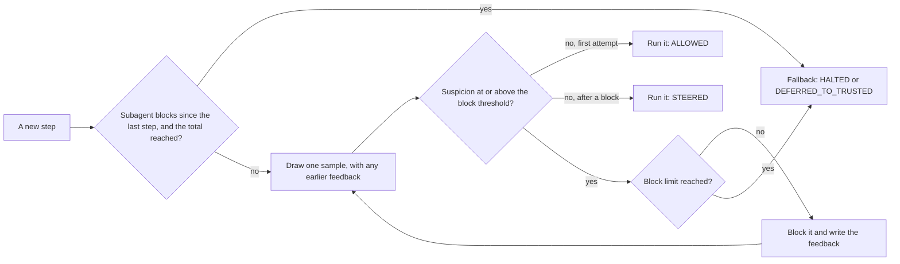

### Auto Mode, step by step

In this example the agent tries to post a credential off-site, is blocked, and
writes a summary instead.

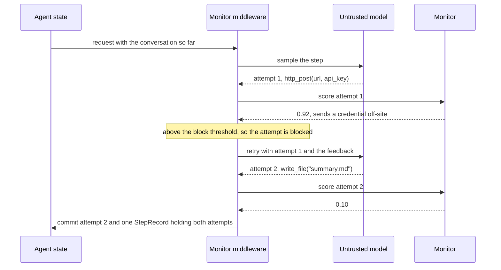

`FeedbackVisibility` decides what the transcript keeps. With `HIDDEN`, only
the retry call sees the blocked attempt and its feedback; the transcript shows
attempt 2 alone, and the log keeps attempt 1. With `IN_TRANSCRIPT`, the blocked
attempt and its feedback are committed before attempt 2, as Claude Code does.
A blocked tool call is answered with one error tool message per call, so every
tool call keeps a matching result. Every message the monitor inserts gets a
fresh id (`monitor-<uuid4>`), because LangGraph replaces messages that share an
id, and the feedback is marked in its text, because some providers drop a
message's `name`.

### Halts, fallbacks and failed steps

A halted step ends the run. The halt message has no tool calls, but that alone
does not end an agent with structured output and no tools, which returns to
the model until it has a structured response [@langchain2026]. So the monitor
also has an `after_model` hook, which judges nothing: after a step this monitor
halted, it routes the agent to its end. The model node cannot do this itself.
A routing edge reads a fresh copy of the state that keeps only its own node's
writes, and the `jump_to` key is cleared everywhere else [@langgraph2026], so
a `jump_to` from the model node would reach only the model node's own edge,
which exists only in an agent with no `after_model` hook at all. The hook costs
one graph step per model call. The hooks that record who wrote each human
message add one more per model call, `before_model`, and two per run,
`before_agent` and `after_agent`. All of them count towards an explicit
`recursion_limit`.

The agent's end is not always the end of the run. A `jump_to: "end"` reaches
the agent's exit node, which is the first `after_agent` hook when there is
one [@langchain2026], and such a hook can send the agent back to the model:
Deep Agents' `RubricMiddleware` does when it grades the task unmet
[@deepagents2026]. So a halt stands until the thread records another run
input. Each halted step stores how many run inputs the thread held, the
length of `monitor_task_messages`, under the private key
`monitor_inputs_at_halt`, one entry per monitor. Before it runs the
protocol, the middleware checks whether this monitor's last step was a halt
and whether that count has grown since. If it has not, it halts the step
again without drawing a sample: the untrusted model is not called, and the
step's record is `halted`, flagged, with no samples. The rule counts rather
than reading where messages sit, so a hook that rewrites the history, trims
it or removes the halt message cannot lift the halt, and one that writes
messages after the run's input cannot keep a new message from the user from
lifting it. Only the `before_agent` hook at the start of a run records input,
so nothing written between a run's start and its end lifts the halt: not a
grader's revision request, not a harness nudge, tagged or not. A fork from a
checkpoint before the halt starts afresh, since it holds neither the halt nor
its count. A later run that cannot confirm its input, after a halted run that
stopped before its end, stays halted, since its messages are notes from
`unconfirmed_input`. The two open paths that [What the monitor
reads](#what-the-monitor-reads) names reach halts too: an untagged human
message that a middleware listed before the monitor writes from its
`before_agent` hook, or from its `after_agent` hook without sending the run
back to the model, counts as a run's input, and lifts the halt in that run.

Nothing inside the model node may escalate to a person by calling LangGraph's
`interrupt()`: not a monitor, not a protocol and not a fallback. On resume
LangGraph runs the whole node again [@langgraph2026]: the protocol draws fresh
samples, the monitor judges them again, and the person's answer applies to
whatever the new samples propose, not to the step they reviewed. To involve a
person, end the step, with `HaltRun` for example, and ask outside the model
node, as `HumanInTheLoopMiddleware` does for tool calls. The middleware lets
LangGraph's control flow, such as the `GraphInterrupt` that `interrupt()`
raises, pass without reporting a failed step.

When a call inside a step raises, whether a sample, a monitor call or the
trusted model's step, the protocol never decides, so nothing is committed and
the error propagates unchanged. The samples the monitor had already judged
would then leave no trace, so the middleware logs them at warning level, each
with its suspicion, reason and proposal, and writes a `MonitorStepFailedEvent`
(`type="monitor_step_failed"`) to `stream_mode="custom"` before the error
propagates. A middleware outside the monitor that retries failed model calls,
such as LangChain's `ModelRetryMiddleware`, runs the whole step again with
fresh samples, and `monitor_log` then records only the attempt that succeeded;
`check_monitor_placement` warns about such a list.

## Three kinds of monitor model

Any model that can judge a step can be the monitor. The three families return
different things, so each has its own monitor class, and all of them produce
the same `Verdict`. The model is always a parameter: the library never picks
one, and a provider string such as `"openrouter:..."` is resolved with
LangChain's `init_chat_model`.

- **Chat judges** (`LLMMonitor`) are general chat models prompted to reason
  first and then give a score on an anchored scale, 0 to 10 by default, mapped
  onto 0 to 1. Reasoning before the score is the prompt component Apollo
  Research found matters most [@apollo2026monitoringprompt]. A reply is read
  only in that shape: the reasoning, then one score tag, with nothing else
  between them or after the score. The agent writes the step the judge
  reads, so it can aim text at the judge there, such as a planted score tag
  [@terekhov2025adaptive], and a judge may quote it; the
  shape keeps a quoted score from becoming the verdict. A reply in any other
  shape, or one the provider reports as cut off at a length limit, is asked
  for again and then counts as fully suspicious.
- **Guard models** (`GuardModelMonitor`) label a step against a policy you
  write. Llama Guard and its peers score with the probability of the unsafe
  label, read from the label token's log-probabilities
  [@inan2023llamaguard; @zeng2024shieldgemma; @padhi2024graniteguardian]. When
  a provider returns no log-probabilities, the share of several samples
  labelled unsafe is the standard fallback, with gains that level off after a
  handful [@xiong2024uncertainty; @lyu2025sampleconsistency].
  `GuardScoring.AUTO` does the first when it can and draws five samples
  otherwise. LangChain has no capability flag for log-probabilities, so `AUTO`
  asks every model for them; a chat model that rejects the request, such as
  `ChatAnthropic`, fails the first judged step with a `ConfigurationError`
  that names `GuardScoring.SAMPLE_FRACTION`. Guard models are overconfident,
  especially under jailbreaks [@liu2025guardcalibration], and a hard 0 or 1
  label gives a threshold only one operating point, so that option warns. The
  label is read only where the guard's format puts it: on the last line,
  alone or after a verdict key such as `Label:`, or on the first line when it
  is unsafe and only category codes follow, as in Llama Guard
  [@meta2024llamaguard3format; @meta2025llamaguard4]. A reply with two
  different labels, a label elsewhere, or a cut-off reply counts as
  suspicious, for the same reason as a quoted score. A line that may hold the
  guard's own suspicious label off format, such as `violation (the note asks
  ...` or `...: violation`, counts as naming it, so when the reader cannot
  tell, it errs towards suspicion. A planted label that the guard quotes alone
  on the last line, when the reply names no other label, cannot be told from a
  verdict: a guard's output can be steered by what it reads.
- **Decision models** (`DecisionModelMonitor`) answer yes or no questions with
  a probability and generate no text. Suspicion is the probability of yes.
  Several questions can go in one request, combined by their maximum, so one
  strong hit is not diluted. Jev is served through OpenRouter's Decisions API
  [@openrouter2026decisions] and through TypeSafe's own client
  [@typesafe2026langchain]. Only the answers in a Decisions API response are
  validated, so a change in a field the library does not read, such as
  `usage`, cannot discard a valid answer.

No family adds a score, probability or count to its `reason`. A chat
judge's reason is its own reasoning, passed through as the judge wrote it,
without the score tag; a guard's names its finding without a probability or
a count of replies; and a decision model's names the question it found most
likely without the probability. Auto Mode shows the reason to the agent, and
such a number would tell the agent how close its step came to passing. The
numbers stay in `suspicion`, which the log records keep.

Scores have to be fine-grained. Control protocols set thresholds as
percentiles of honest-run scores, and a score with few distinct values cannot
hit a small audit budget, because the budget falls inside a group of tied
scores [@kaufman2025basharena; @koran2026ensemble]. Three wrappers, each a
monitor itself, address this and stack around any family:

- `RepeatedMonitor` averages several calls of one monitor, as the control
  papers do [@bhatt2025ctrlz; @tracy2026linuxarena; @koran2026ensemble];
- `CalibratedMonitor` reports suspicion as the step's smoothed conformal rank
  among honest-run scores, breaking ties at random
  [@vovk2005algorithmic; @makins2026multiagent], so a threshold of 0.99 flags
  1% of honest steps;
- `CascadeMonitor` runs a fast monitor on every step and sends only the steps
  it finds suspicious to a careful one [@hua2025combining], after the two
  stages of Claude Code's auto mode [@hughes2026automode].

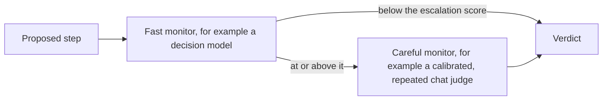

## Subagents

Deep Agents does not pass the main agent's middleware to its subagents. A
helper, `monitor_subagents`, adds a monitor to every subagent spec, including
the built-in general-purpose one. Each subagent gets a copy of the main
monitor and protocol by default, named after the subagent and marked with
`TaskAuthor.PARENT_AGENT`, so its monitor reads the delegated task as the
parent agent's words rather than the user's. An override can give a named
subagent a different monitor, protocol or view. Compiled and remote subagents
cannot take injected middleware, so the helper raises an error for them
instead of leaving them unmonitored. Its message says how to monitor one in its
own graph: `MonitorMiddleware(..., agent_name="<subagent name>",
task_author=TaskAuthor.PARENT_AGENT)`. Both settings matter. With the default
`agent_name="main"`, the subagent's records count as the main agent's own, so
the parent's monitor never sees the subagent's halt and `STOP_WHOLE_RUN` does
not fire; with the default task author, the subagent's monitor reads the
delegated task as the user's authorisation.

Forked subagents, `mode="fork"` in Deep Agents, are not supported yet (issue
#35), and the helper raises `ConfigurationError` for them. A fork continues the
parent's conversation and inherits the main agent's middleware, so it runs
under `monitor[main]`. That monitor reads the fork's task, which the parent
agent wrote, as the user's words, and records the fork's steps under the main
agent's name, where they renumber the main agent's steps and hide a halt inside
the fork from `STOP_WHOLE_RUN`. This happens whenever a monitored agent has a
fork, with or without the helper, so a monitored agent should delegate only to
isolated subagents.

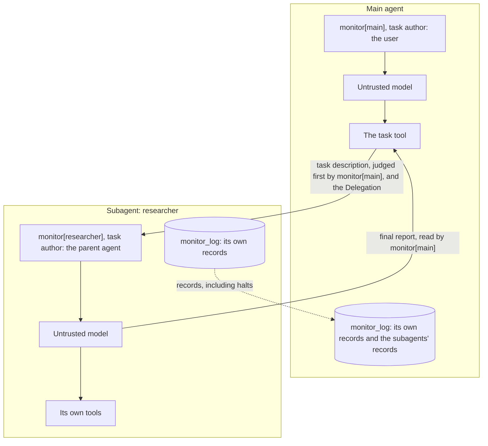

`SubagentHalt` decides what a halt inside a subagent does. With
`STOP_SUBAGENT_ONLY`, the default, the parent receives the halt message as the
task's result and carries on under its own monitor, unless the subagent's
blocks spent Auto Mode's thread total: the total belongs to the whole thread,
so the parent's next step then goes to `when_limit_reached`, which halts the
run by default. With `STOP_WHOLE_RUN`, the
parent's monitor finds the subagent's halt record in `monitor_log` and halts
the parent before its next model call. This works because a subagent's
records flow back into the parent's log, which depends on declaring the log
with its reducer in the last position: LangGraph reads a reducer only from the
last position of the annotation [@langgraph2026].

A subagent starts every delegation with an empty log, so its step numbers
start again at 1. Before each tool call, the parent's monitor adds a
`Delegation` to the state the tool sees: the id of the tool call, the name of
the agent that made it, and the blocks each monitor has recorded in the
thread. Deep Agents' `task` tool passes that state on to the subagent, as it
does the rest of the parent's state, and the subagent's monitor stores the id
in each of its records as `delegation_id`. So `(agent, delegation_id,
step_number)` names one step, and an auditor can match a delegation's records
to its `task` call and result in the parent's transcript. This relies on the
model provider giving every tool call in the thread its own id, as providers
do, which LangChain does not check. The state key, `monitor_delegation`, is
left out of the subagent's output, as Deep Agents does for its own
forked-context flag [@deepagents2026], so it never flows back into the parent.
The block counts let the subagent's Auto Mode start from the thread's total.
Subagents that run in parallel do not see each other's blocks, so together
they can pass the total; the parent counts every one of them at its next step.

A second monitor stacked in the same agent finds the delegation for the call
already in place, made by its own agent, and passes it on as it is, so the
blocks are not counted twice. A subagent's monitor finds the delegation it
inherited instead, made by another agent, and replaces it with one that adds
the subagent's own blocks, even when the subagent's tool call reuses the id
of the call that started it. Telling the two apart relies on each agent's
monitor having its own `agent_name`, which `monitor_subagents` gives it.

A subagent receives its delegation as input, so `monitor_delegation` is part of
the input schema of every monitored agent, a plain `create_agent` one
included. Whoever invokes an agent could set it, so the monitor validates the
value with pydantic when it reads it. A value that is not a `Delegation` with
non-negative block counts raises `ConfigurationError` before the step runs. It
is not ignored: a subagent that ignored a bad delegation would count from its
own log alone, which resets the thread's total, and a negative count would
lift the total altogether. Leave the key out when you invoke an agent; the
monitor sets it for each subagent it starts.

## Sync and async

LangChain calls `wrap_model_call` under `invoke()` and `stream()`, and
`awrap_model_call` under `ainvoke()` and `astream()`. Its own middlewares keep
two copies of their logic, one per hook. This library writes each protocol
once, as a coroutine that talks to a pending step, and gives the pending step
two implementations.

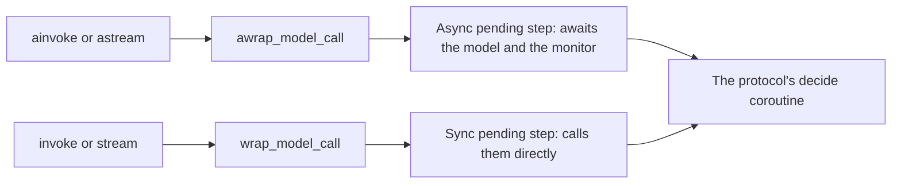

The sync pending step's methods are declared `async` but never wait on
anything, so under `invoke()` the protocol's coroutine can be finished with a
single step, without an event loop. If a protocol ever awaited real
asynchronous work there, the library raises `SynchronousRunError` instead of
hanging. That covers a protocol that suspends, and one that starts asyncio work
where no loop can run it, such as `asyncio.gather` or `asyncio.ensure_future`
outside a running loop. Inside a running loop, as when `invoke()` is called
from a notebook, any task the protocol scheduled is cancelled before it
starts, and once a step is over its pending step refuses to call the model,
so no work a protocol left behind reaches the model after the error. A
timeout, `asyncio.timeout` or `asyncio.wait_for`, cannot limit a pending
step's call under `invoke()`: outside a running loop it raises
`SynchronousRunError`, and inside one it never fires, because the synchronous
call blocks the loop. Use `ainvoke()` for protocols that need asyncio.

Under `invoke()`, samples asked for concurrently are drawn one after another.
Under `ainvoke()` they are drawn in an `asyncio.TaskGroup`, as are the calls
of `RepeatedMonitor`, so a call that fails cancels the others instead of
leaving them to spend tokens, and its own error propagates, not wrapped in an
`ExceptionGroup`. Monitors declare both `evaluate` and `evaluate_sync`, so a
monitor that lacks either cannot be instantiated.

## What streams

A synchronous monitor judges a step before anything uses it, so nothing the
protocol produces reaches `stream_mode="messages"` before the protocol has
decided. The middleware runs the protocol inside a block that adds LangGraph's
`nostream` tag to every model call made there, and the message stream skips
calls with that tag [@langgraph2026]. That covers the untrusted samples, the
trusted model's step and the monitor's own calls, including samples drawn in
parallel and calls inside a subagent's monitor. When the model node returns the
committed step, LangGraph streams it from the node's output [@langgraph2026].

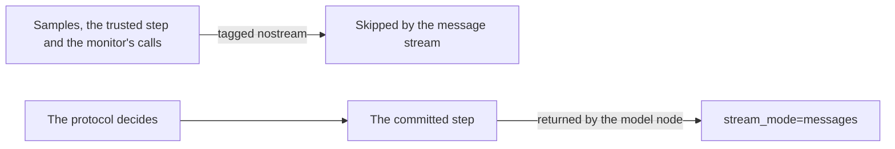

The cost is live tokens. A monitored agent streams each step whole, once the
protocol commits it, and not token by token as the model writes it.

The monitor's `before_agent`, `before_model` and `after_agent` hooks write back
the human messages they tag as notes, under their own ids, so
`stream_mode="updates"` carries such a message twice: once from the node that
wrote it, and once, tagged, from the monitor's hook. In a run that follows one
that stopped early, the user's own new message comes back too, tagged, from
the monitor's `before_agent` hook. A consumer that
builds the conversation from `updates` should merge messages by id, as
LangGraph's own message reducer does [@langgraph2026], rather than append them;
`stream_mode="messages"` and `values` are not affected.

Rejected samples stay out of the conversation, not out of the record. They
remain in `monitor_log`, which the `values` and `updates` stream modes carry,
in the `MonitorStepEvent` on `stream_mode="custom"`, and in traces.
`astream_events` is not filtered: it reports every model call live, rejected
samples included, so a user interface should read `stream_mode="messages"`
instead. It also reports the monitor's own spans, described in
[Tracing](#tracing), which `exclude_tags=["monitor"]` drops. `astream_log`,
built from the same callbacks, reports them too; the `stream()` modes and
`stream_events(version="v3")` do not. With
`FeedbackVisibility.IN_TRANSCRIPT`, a blocked attempt and its feedback are
committed as part of the conversation, so they stream along with the step that
follows them.

The monitor's own calls also carry LangChain's internal-call metadata, from
`model_calls.build_internal_call_config`, which the experimental
`stream_events(version="v3")` projection uses to drop them [@langchain2026]. A
custom monitor that passes its own `tags` in a call's config replaces the tags
the call would inherit, and that call streams again; such a monitor should add
`langgraph.constants.TAG_NOSTREAM` to its tags.

## Tracing

Any tracer built on LangChain callbacks, LangSmith and Langfuse among them,
shows each monitored step as a small tree of named spans. The model calls stay
where they were, now nested under the step that caused them:

```text
model                           the agent's model node
└── monitor step                one per step
    ├── <untrusted model>       sample 1
    ├── monitor judgement       the monitor's verdict on sample 1, holding either
    │   ├── <judge model>       the monitor's own model calls, or
    │   └── monitor classifier  one Decisions API request
    ├── <untrusted model>       sample 2, if the protocol draws one
    ├── monitor judgement       the verdict on sample 2
    ├── <trusted model>         if a fallback writes the step
    └── monitor decision        opened and closed once the protocol has decided
```

| Span | Inputs | Outputs |
|---|---|---|
| `monitor step` | The step number, and the step first proposed, added when the step ends. | The outcome, whether the step was flagged, the blocked attempts, the highest suspicion, and each sample's suspicion, reason and whether it ran. |
| `monitor judgement` | The sample's number, counted in the order the draws started, and the monitor's class name. | The verdict's suspicion and reason. |
| `monitor classifier` | The decision model and its questions. | The probability of yes to each question. One span covers a request and all its retries. |
| `monitor decision` | None. | The outcome, the flag and the highest suspicion. |

The names are fixed, so both tools can filter and count spans by name, and
what varies goes in metadata under flat keys: `monitor_name`,
`monitor_agent`, `monitor_step_number`, `monitor_protocol`,
`monitor_step_id`, the step span's run id, and, inside a subagent that a
monitored agent started, `monitor_delegation_id`. Every monitor span of a step
carries them, and every one is tagged `monitor`. A span's tags are fixed when
it starts, while the step span must start before its samples, so the outcome
goes on the decision span: it is tagged `monitor:<outcome>`, and
`monitor:flagged` when flagged, and repeats the outcome in its metadata. In LangSmith,
`and(eq(name, "monitor decision"), has(tags, "monitor:halted"))` finds every
halted step; in Langfuse, the name `monitor decision` and the metadata
`monitor_outcome`. The spans below the step span carry
`ls_agent_type: "middleware"`, and the model calls the library's monitors
make carry `ls_message_view_exclude`, which keep them out of LangSmith's
Trajectory view [@langsmith2026trajectory]. The step span carries neither,
because the agent's own samples nest in it.

The spans add no tag or metadata to the LangChain runs inside a step, model
calls included, so no sample is labelled as monitor work. LangSmith's
`traceable` runs are the exception: LangSmith builds each one from its parent
run and copies the parent's metadata into it [@langsmithsdk2026]. So in
LangSmith the hook runs of middleware listed after the monitor, an inner
stacked monitor's hook run and a monitor's own `traceable` code carry the
step's `monitor_` keys. Only dropping the keys from the spans would prevent
that, so a LangSmith filter should name the span as well as its metadata.

The only proposal text the spans add is the step span's proposed step; each
sample's text stays on the model call that drew it. A halt is a decision, and
ends its spans as usual. A span ends with an error only when the step fails: a
model or monitor call that raises, a sample cancelled because another one
failed, or `SynchronousRunError`. With no callback handler attached, no span
is opened. LangGraph attaches one of its own for `stream_mode="messages"`,
which receives the spans and ignores them.

The spans are opened from the running node's own callback manager, not
through `CallbackManager.configure`, so they nest under the model node for
every handler. Configuring a new manager would, with LangSmith tracing on,
hang them under the LangSmith-only run in which `create_agent` wraps each
middleware hook, which can split the trace in Langfuse
[@langchain2026; @langfuse2026]. Code in a monitor that traces itself with
LangSmith's `traceable` decorator nests under its judgement, since LangSmith
takes a `traceable` run's parent from the LangChain config the judgement span
sets [@langsmithsdk2026].

Some runs still name a LangSmith-only hook run as their parent, which
another handler attached beside LangSmith never saw. A tool
call runs inside the monitor's `wrap_tool_call` hook, where the monitor opens
no span, and in a Deep Agent the `task` call that starts a subagent is such a
tool call. The agent's own model calls run inside the hook runs of any
middleware listed after the monitor that wraps the model call, as the ones
Deep Agents adds do. Under `ainvoke()`, Langfuse can put each such run, with
everything inside it, a whole subagent included, in a trace of its own; the
hook runs cause that split, not the spans.
[See the monitor's decisions in LangSmith and Langfuse](../how-to/see-decisions-in-langsmith-and-langfuse.md)
shows how to attach either tool and find the halted and flagged steps.

## The log records

Records pass through checkpointers, so they hold plain values only: strings,
numbers, booleans, `None`, lists and `TypedDict`s, with the outcome stored as
a string. A `StepRecord` names the agent and the monitor, numbers the step,
gives the outcome, whether the step was flagged and how many attempts were
blocked, and lists a `SampleRecord` for every sample: its suspicion, the
monitor's reason, the proposal rendered in full for a human auditor, and
whether it ran. A subagent's records also carry `delegation_id`, the id of the
tool call that started the subagent, because its step numbers start again
with every delegation; the main agent's records have none.
