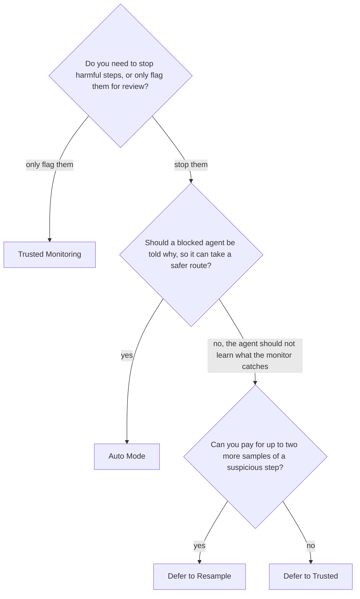

# Choose a control protocol

This guide helps you pick one of the four control protocols. The monitor gives
every step a suspicion score from 0 to 1; the protocol decides what that score
does. All four work with every monitor, so you can change the protocol without
touching the monitor.

## Decide in three questions

1. **Stop or flag.** A flag marks a step in `monitor_log` for a person to
   review later. It never blocks anything: by the time someone reads the log,
   the step has run. If you only want to watch, for example while you collect
   scores to calibrate a threshold, use Trusted Monitoring.
2. **Tell the agent or not.** Auto Mode tells the agent why a step was blocked,
   which helps an honest agent that overreached find another way. It also
   tells a scheming agent what the monitor catches. The Defer protocols replace
   a suspicious step silently: the agent never sees the step it proposed.
3. **Resample or defer at once.** Defer to Resample asks the agent again before
   giving up on it, so an honest agent that proposed one odd step usually keeps
   its turn. Defer to Trusted hands the step to a trusted model straight away,
   which costs fewer calls but loses the stronger model's work on that step.

## Compare them

The costs below assume a monitor that makes one model call per judgement, such
as a plain `LLMMonitor`. A monitor that averages several calls, such as
`RepeatedMonitor`, multiplies the monitor's share.

| | Trusted Monitoring | Defer to Trusted | Defer to Resample | Auto Mode |
|---|---|---|---|---|
| What runs | The agent's step, always | The agent's step, or the trusted model's when it is suspicious | The least suspicious acceptable sample, or the fallback's step when none is acceptable | The first acceptable attempt, or the fallback's step once a block limit is reached |
| Model calls, ordinary step | 2: agent, monitor | 2 | 2 | 2 |
| Model calls, suspicious step | 2 | 3: adds the trusted model | Up to 6: three samples and three judgements, plus the fallback | 2 per attempt, up to 3 attempts, plus the fallback |
| Latency, suspicious step | No extra | One trusted call | Up to two more rounds in sequence, or one round in parallel | One more round per attempt |
| What the agent sees | Its own step | The trusted step, as if it were its own | The chosen sample; never the rejected ones | The blocked attempt and the monitor's reason, then its own next attempt |
| Outcomes in the log | `allowed` | `allowed`, `deferred_to_trusted` | `allowed`, `resampled`, `deferred_to_trusted`, `halted` | `allowed`, `steered`, `deferred_to_trusted`, `halted` |
| Flagged when | Suspicion at or above `flag_threshold` | Suspicion at or above `audit_threshold` | The lowest suspicion across the samples is at or above `audit_threshold`, or the run halted | Any attempt was blocked |
| Use it when | You want to observe, calibrate or audit, and blocking honest work costs more than catching a bad step late | A capable trusted model exists and you want the simplest intervention | You want to keep most of the stronger model's work and gather evidence from repeated samples | Most suspicious steps are an honest agent overreaching, and a person would otherwise approve each step |

A round is one call of the agent's model followed by one call of the monitor.
Parallel resampling lowers latency only under `ainvoke()`; under `invoke()`
the samples are drawn one after another.

## Where each protocol comes from

- **Trusted Monitoring** and **Defer to Trusted** come from the AI control
  paper [@greenblatt2023aicontrol]. An untrusted model does the work, a
  monitor rates each output, and suspicious outputs are audited or replaced by
  a trusted model's own output.
- **Defer to Resample** comes from Ctrl-Z [@bhatt2025ctrlz]. It draws fresh
  samples of a suspicious step and defers only when every sample looks
  suspicious. Ctrl-Z reports a better trade-off between safety and usefulness
  than deferring at once: an honest step usually passes on a resample, and the
  extra samples are evidence for an auditor. The same resampling gives an
  injection aimed at the monitor several tries, which makes one that sometimes
  works more likely to get through [@terekhov2025adaptive].
- **Auto Mode** follows Claude Code's auto mode [@hughes2026automode]. A
  classifier reviews each action before it runs, a blocked action is answered
  with the reason, and repeated blocks escalate. The limits of three blocks in
  a row and twenty in all are the ones Claude Code uses.

## Set it up

Each protocol has its own guide, with a complete example and every option:

- [Use Trusted Monitoring](use-trusted-monitoring.md)
- [Use Defer to Trusted](use-defer-to-trusted.md)
- [Use Defer to Resample](use-defer-to-resample.md)
- [Use Auto Mode](use-auto-mode.md)

Whichever you choose, every threshold defaults to a placeholder and warns with
an `UncalibratedThresholdWarning` until you pass your own value. The protocol
guides say how to choose one.

## Related guides

- [Use a chat judge](use-a-chat-judge.md) for the monitor most setups start with.
- [Combine and calibrate monitors](combine-and-calibrate-monitors.md) for thresholds that mean an audit budget.
- [Read the monitor log](read-the-monitor-log.md) for what each protocol records.
