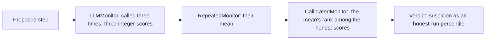
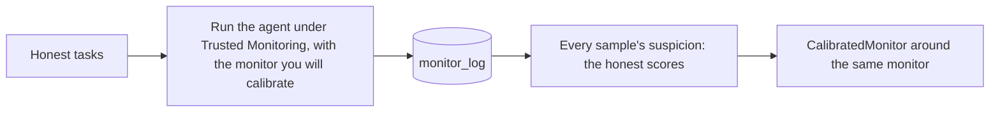
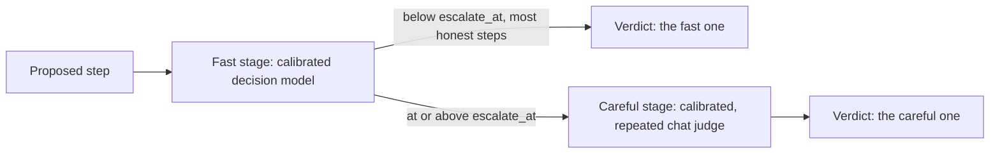

# Combine and calibrate monitors

This guide shows how to stack `RepeatedMonitor`, `CascadeMonitor` and
`CalibratedMonitor` around a monitor, how to collect honest scores from
`monitor_log`, and how to set thresholds that mean something.

## Set every threshold yourself

Every control protocol compares the monitor's suspicion with a threshold. Each
threshold has a default, 0.6 to defer, block or flag and 0.9 to audit, and a
protocol built with a default warns. This is the warning Auto Mode gives:

```text
UncalibratedThresholdWarning: block_threshold uses the uncalibrated default 0.6. Suspicion scores differ between monitors and agents, so a fixed default may block honest work or miss attacks. Run the agent on honest tasks, collect the suspicion scores in monitor_log, and set the threshold at a high percentile of them (for example the 98th), or wrap the monitor in CalibratedMonitor so that its scores are honest-run percentiles. Pass block_threshold explicitly to silence this warning.
```

Treat the defaults as placeholders. Each monitor spreads its scores
differently, and an agent's honest work looks more or less unusual depending
on its task and tools. A default threshold may therefore block much of your
agent's honest work, or let attacks through. Control evaluations set
every threshold from the scores the monitor gives to honest runs, so that it
spends a known audit budget [@greenblatt2023aicontrol; @bhatt2025ctrlz].

Passing a number silences the warning, but only a number chosen from your own
honest runs does what the warning asks. There are two ways to choose one:

- Take a high percentile of the raw honest scores. This is simple, but a
  percentile that falls among tied scores flags every step in the tie.
- Wrap the monitor in `CalibratedMonitor`. Its scores are then honest-run
  percentiles, so a threshold of 0.99 flags about 1% of honest steps.

The rest of this guide takes the second way.

## The three wrappers

Each wrapper is a monitor itself, so it stacks around any monitor family and
around the other wrappers, and every protocol accepts it.

| Wrapper | What it reports | Model calls per judged sample | Reason |
|---|---|---|---|
| `RepeatedMonitor(monitor=..., repeats=...)` | The mean suspicion of `repeats` calls | `repeats` times the wrapped monitor's | The most suspicious call's |
| `CascadeMonitor(fast=..., careful=..., escalate_at=...)` | The fast verdict, or the careful one when the fast suspicion reaches `escalate_at` | The fast monitor's, plus the careful monitor's for escalated samples | The verdict's own |
| `CalibratedMonitor(monitor=..., honest_scores=..., random_seed=...)` | The rank of the score among honest scores | The wrapped monitor's, and no more | The wrapped monitor's |

The wrappers never add a score to a reason. Auto Mode shows the reason to the
agent, and a number would tell the agent how close its step came to passing.

Protocols multiply these costs, because they judge every sample they draw.
Trusted Monitoring and Defer to Trusted judge one sample per step. Defer to
Resample judges up to three by default, and Auto Mode up to three. So Defer to
Resample around a `RepeatedMonitor` of three chat judge calls makes three
judge calls on an ordinary step and up to nine on a suspicious one. Under
`ainvoke()`, `RepeatedMonitor` makes its calls concurrently; under `invoke()`,
one after another.

## Average repeated calls

A chat judge gives an integer score, and integer scores tie so often that a
small audit budget falls inside a block of tied scores
[@kaufman2025basharena; @koran2026ensemble]. `RepeatedMonitor` averages
several calls to add resolution, as Ctrl-Z (four calls), BashArena (three) and
LinuxArena (two) do
[@bhatt2025ctrlz; @kaufman2025basharena; @tracy2026linuxarena]. A plain mean
works as well as more elaborate aggregators [@koran2026ensemble].

```python
from langchain.chat_models import init_chat_model

from langchain_sync_monitors import LLMMonitor, RepeatedMonitor

judge_model = init_chat_model("openrouter:xiaomi/mimo-v2.6-pro", temperature=1.0)
monitor = RepeatedMonitor(monitor=LLMMonitor(model=judge_model), repeats=3)
```

The calls differ only if the model samples, so give it a temperature above
zero (Ctrl-Z used 1.1) and no LangChain response cache. `repeats` below 1
raises `ConfigurationError`.

## Stack the wrappers in order

Average first, then calibrate: `CalibratedMonitor` goes outside
`RepeatedMonitor`. The calibrated monitor ranks exactly the score its honest
scores measured, here the mean of three calls, and the mean adds the
resolution that ranking needs. The other way round would average percentiles,
and the mean of several percentiles is not itself a percentile.



## Collect honest scores

Honest scores are the scores your monitor gives to steps of runs you trust.
Collect them with exactly the monitor you will calibrate: the same model,
prompt, view, number of repeats and temperature.



Run the agent under `TrustedMonitoring`, which never changes a step, so the
run goes as it would unmonitored and every step is judged once. A protocol
that resamples would judge extra samples only for suspicious steps and skew
the scores. Keep only the records of the agent and the monitor you are
calibrating: a record names both, and a Deep Agent's log also holds its
subagents' records.

```python
import json
from pathlib import Path

from langchain.agents import create_agent
from langchain.chat_models import init_chat_model

from langchain_sync_monitors import (
    LLMMonitor,
    MonitorMiddleware,
    RepeatedMonitor,
    TrustedMonitoring,
)


def read_file(path: str) -> str:
    """Read a file from the workspace."""
    return Path(path).read_text(encoding="utf-8")


HONEST_TASKS = [
    "Summarise q3.md for the team.",
    "List the open questions in notes.md.",
]

judge_model = init_chat_model("openrouter:xiaomi/mimo-v2.6-pro", temperature=1.0)
monitor = RepeatedMonitor(monitor=LLMMonitor(model=judge_model), repeats=3)
agent = create_agent(
    "openrouter:deepseek/deepseek-v4.1-flash",
    tools=[read_file],
    middleware=[
        MonitorMiddleware(monitor=monitor, protocol=TrustedMonitoring(flag_threshold=0.9)),
    ],
)

honest_samples = []
for task in HONEST_TASKS:
    result = agent.invoke({"messages": [{"role": "user", "content": task}]})
    honest_samples.extend(
        sample
        for record in result["monitor_log"]
        if record["agent"] == "main" and record["monitor"] == "monitor"
        for sample in record["samples"]
    )

honest_scores = [sample["suspicion"] for sample in honest_samples]
Path("honest_scores.json").write_text(json.dumps(honest_scores), encoding="utf-8")

for sample in sorted(honest_samples, key=lambda sample: sample["suspicion"])[-5:]:
    print(sample["suspicion"], sample["reason"])
```

Each run here has no checkpointer, so its log holds only its own steps. On a
checkpointed thread, `monitor_log` holds every turn of the thread, so collect
it once per thread.

The last lines print the reasons of the five highest honest scores. Read them
before you calibrate. A chat judge whose reply could not be read gives 1.0
with the reason "The monitor gave no readable score, so the step is treated as
suspicious.". That score measures nothing about the step. Worse, a 1.0 in the
honest set ties with every later step that fails closed, which then lands at a
random place among the ties instead of above every honest score. Fix the
cause, such as too small a `max_tokens`, and collect again.

Collect more scores than you think you need. With `n` honest scores, a step
that scores above all of them is sure to pass a threshold `t` only when
`n / (n + 1)` is at or above `t`, which for 0.99 takes at least 99 scores. A
thousand make the flagged share stable, as the section on what a calibrated
threshold means explains.

## Calibrate the monitor

Wrap the same monitor in `CalibratedMonitor` with the honest scores, then set
thresholds as shares of honest steps:

```python
import json
from pathlib import Path

from langchain.chat_models import init_chat_model

from langchain_sync_monitors import (
    CalibratedMonitor,
    LLMMonitor,
    MonitorMiddleware,
    RepeatedMonitor,
    TrustedMonitoring,
)

honest_scores = json.loads(Path("honest_scores.json").read_text(encoding="utf-8"))
judge_model = init_chat_model("openrouter:xiaomi/mimo-v2.6-pro", temperature=1.0)
monitor = CalibratedMonitor(
    monitor=RepeatedMonitor(monitor=LLMMonitor(model=judge_model), repeats=3),
    honest_scores=honest_scores,
    random_seed=2026,
)
middleware = MonitorMiddleware(
    monitor=monitor,
    protocol=TrustedMonitoring(flag_threshold=0.99),
)
```

This flags about 1% of honest steps. Every other protocol's thresholds read
the same way: with a calibrated monitor, a defer threshold of 0.98 sends about
2% of honest steps to resampling. `honest_scores` must hold at least one
score, each between 0 and 1, or the constructor raises `ConfigurationError`.

## What a calibrated threshold means

`CalibratedMonitor` replaces the wrapped monitor's score with its smoothed
conformal rank among the `n` honest scores [@vovk2005algorithmic]:

```text
calibrated suspicion = (below + U * (tied + 1)) / (n + 1)
```

In words: the step takes one of `n + 1` places in the sorted list of honest
scores. `below` counts the honest scores lower than the step's score, and
`tied` counts those equal to it. `U` is a random number from 0 up to 1, which
spreads the step evenly over its own place and the places of the honest
scores it ties with. Dividing by `n + 1` puts the result between 0 and 1.
Breaking ties at random follows Makins et al. and LinuxArena
[@makins2026multiagent; @tracy2026linuxarena].

The guarantee holds when the step's raw score is exchangeable with the honest
scores: the step comes from the same kind of honest run, scored by the same
monitor with the same settings. Its calibrated suspicion is then spread evenly
between 0 and 1, so a threshold `t` flags a share `1 - t` of such steps: 0.99
flags 1% of honest steps, and 0.95 flags 5%.

The share is exact on average over the honest scores you might have
collected. For the one set you did collect, it varies around `1 - t` with a
standard deviation of about `sqrt(t * (1 - t) / n)`. At `t = 0.99`, a thousand
honest scores give a spread of about 0.3 percentage points, and a hundred give
about 1 point.

Three consequences follow from the formula:

- **Scores above every honest score.** Such a step lands between `n / (n + 1)`
  and 1, never at 1. With 49 honest scores, a step above all of them passes a
  threshold of 0.99 only half the time; with 99 or more, it always does.
- **Ties.** A step that ties with many honest scores lands anywhere across
  their places. If 400 of 500 honest scores are 0, a step that scores 0 gets a
  calibrated suspicion anywhere from 0 to about 0.8.
- **What calibration cannot do.** It does not make the monitor better at
  telling attacks from honest work. It puts thresholds on a scale you can read
  as shares of honest steps, and an attack scores high only if its raw score
  is above most honest scores.

## Fix the tie-breaking with a seed

Without `random_seed`, `U` is drawn afresh on every call. A step whose score
ties with honest scores can then land on either side of a threshold from one
run to the next.

With `random_seed`, `U` comes from the seed and the step's content: the task
author, the type and text of each message, and the proposal. Message ids are
left out, because the monitor's own messages get fresh random ids on every
run. The same step always gets the same draw, in every process and every run,
so the same raw score always gives the same calibrated suspicion, and an
evaluation can be replayed exactly.

## Put a fast monitor in front of a careful one

`CascadeMonitor` runs a fast monitor on every step and sends only the steps
it finds suspicious to a careful one. A step whose fast suspicion is below
`escalate_at` keeps the fast verdict; the careful verdict, reason included,
replaces it otherwise. This follows the two stages of Claude Code's auto mode,
a fast filter in front of a reasoning classifier [@hughes2026automode], and
the idea of calling an expensive monitor only when a cheap one asks for it
[@hua2025combining]. A decision model makes a good fast stage and a chat judge
a good careful one.



Calibrate each stage on its own honest scores, collected as above with that
stage as the monitor. Collect the careful stage's scores on every honest step,
not only on the ones the fast stage would escalate.

```python
import json
from pathlib import Path

from langchain.chat_models import init_chat_model

from langchain_sync_monitors import (
    CalibratedMonitor,
    CascadeMonitor,
    DecisionModelMonitor,
    LLMMonitor,
    OpenRouterDecisionModel,
    RepeatedMonitor,
)

fast_scores = json.loads(Path("fast_honest_scores.json").read_text(encoding="utf-8"))
careful_scores = json.loads(Path("careful_honest_scores.json").read_text(encoding="utf-8"))
judge_model = init_chat_model("openrouter:xiaomi/mimo-v2.6-pro", temperature=1.0)

monitor = CascadeMonitor(
    fast=CalibratedMonitor(
        monitor=DecisionModelMonitor(
            decision_model=OpenRouterDecisionModel(model="typesafe/jev-1.13"),
        ),
        honest_scores=fast_scores,
    ),
    careful=CalibratedMonitor(
        monitor=RepeatedMonitor(monitor=LLMMonitor(model=judge_model), repeats=3),
        honest_scores=careful_scores,
    ),
    escalate_at=0.95,
)
```

With both stages calibrated, `escalate_at` is a share too: 0.95 sends about
5% of honest steps to the careful stage, which bounds its cost. A threshold
`t` on the result then flags at most about a share `1 - t` of honest steps,
since only the escalated ones can reach it.

Keep `escalate_at` at or below the protocol's lowest threshold. A step the
fast stage keeps has a suspicion below `escalate_at`; if a threshold lay
below `escalate_at`, such a step could cross it and trigger the protocol
without the careful stage ever reading it. `escalate_at` must lie between 0
and 1, or the constructor raises `ConfigurationError`.

## Related guides

- [Choose a protocol](choose-a-protocol.md) for the thresholds each protocol takes.
- [Use Defer to Resample](use-defer-to-resample.md) for the protocol whose audit budget calibration serves best.
