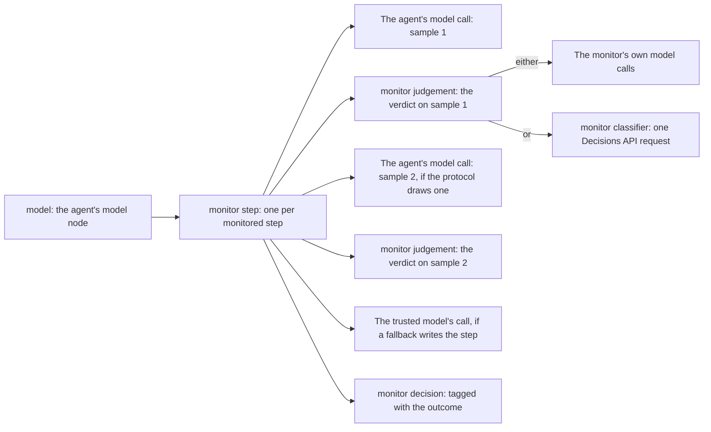

# See the monitor's decisions in LangSmith and Langfuse

This guide shows how to find each monitored step in LangSmith or Langfuse: the
spans the monitor opens, what each one holds, how to attach either tool, and
how to find the halted and flagged steps.

[TOC]

## Read the span tree

Any tracer built on LangChain callbacks, LangSmith and Langfuse among them,
shows each monitored step as a small tree of named spans. The agent's model
calls stay where they were, nested under the step that drew them, and the
monitor's own calls nest under the judgement they served:



- **Order and timing.** The step span's children are listed in the order they
  start. The step span opens before the first sample and ends when the step is
  committed; the decision span opens and ends at once, when the protocol has
  decided.
- **Judgements.** The chat judges, the guards and `TypeSafeDecisionModel` make
  model calls, which nest in the judgement. `OpenRouterDecisionModel` sends its
  request without LangChain, so its judgement holds a `monitor classifier`
  span instead.
- **Errors.** A halt is a decision like any other, so it never marks a span as
  failed. A span ends with an error only when the step fails: a model or
  monitor call raises, a sample is cancelled because another one failed, or
  `SynchronousRunError` is raised.
- **No handler, no span.** With no callback handler attached, the monitor
  opens no span.

Beside `model`, every tracer also shows the monitor's four graph nodes, which
open no span of their own: `monitor[main].before_agent` and
`monitor[main].after_agent` once per run, and `monitor[main].before_model` and
`monitor[main].after_model` around each model call.
[Allow for the graph steps](read-the-monitor-log.md#allow-for-the-graph-steps)
says what each does.

LangSmith alone also shows the runs in which `create_agent` wraps each
middleware hook [@langchain2026]:

- an empty `monitor[main].wrap_model_call`, or `awrap_model_call` under
  `ainvoke()`, beside `monitor step` under `model`, or inside the hook runs of
  the middleware listed before the monitor, as in a Deep Agent;
- the hook runs of the middleware listed after the monitor, such as the ones
  Deep Agents adds, around each sample, so a sample sits one level below
  `monitor step` for each of them.

## Know what each span holds

| Span | Inputs | Outputs | Tags |
|---|---|---|---|
| `monitor step` | `step_number`, and `proposed_step`, the step first proposed, added when the span ends | `outcome`, `flagged`, `blocked_count`, `max_suspicion`, and each sample's `suspicion`, `reason` and `executed` | `monitor` |
| `monitor judgement` | `sample_number`, and `monitor`, the monitor's class name | `suspicion` and `reason` | `monitor` |
| `monitor classifier` | `model`, and `questions`, each question's text by its key | `answers`, the probability of yes to each question; one span covers a request and all its retries | `monitor` |
| `monitor decision` | None | `outcome`, `flagged` and `max_suspicion` | `monitor`, `monitor:<outcome>`, and `monitor:flagged` when the step is flagged |

- **Proposal text.** Only the step span carries any: its `proposed_step`.
  Each sample's text stays on the model call that drew it.
- **Sample numbers.** A judgement's `sample_number` counts the step's samples
  in the order their draws started, so judgement n describes the n-th entry
  of the step span's `samples`, under parallel resampling too.
- **Steps without samples.** A step decided before any sample, such as a
  standing halt, a subagent's halt or Auto Mode's thread total, has `None` as
  its `proposed_step` and `max_suspicion`.
- **Failed steps.** When a step fails before the protocol decides, its
  `proposed_step` is the first sample the monitor had judged, if any.

Every monitor span of a step carries flat metadata keys that name the step:

| Metadata key | Holds | On |
|---|---|---|
| `monitor_name` | The monitor's `label` | Every monitor span |
| `monitor_agent` | The agent: `main`, or a subagent's name | Every monitor span |
| `monitor_step_number` | The step's number, as in `monitor_log` | Every monitor span |
| `monitor_protocol` | The protocol's class, such as `AutoMode` | Every monitor span |
| `monitor_step_id` | The step span's run id | Every monitor span |
| `monitor_delegation_id` | The id of the `task` call that started the subagent | Every monitor span inside a subagent that a monitored agent started |
| `monitor_outcome`, `monitor_flagged` | The decision | `monitor decision` |
| `monitor_max_suspicion` | The highest suspicion among the step's samples | `monitor decision`, when the step judged a sample |
| `ls_agent_type`, set to `middleware` | Keeps the span out of LangSmith's Trajectory view; inside a Deep Agents subagent, LangSmith's tracer sets it to `subagent` instead | `monitor judgement`, `monitor classifier` and `monitor decision` |

`monitor_name`, `monitor_agent`, `monitor_step_number` and, inside a subagent,
`monitor_delegation_id` match a span to its `StepRecord` in `monitor_log`.
`monitor_step_id` finds a step again in Langfuse, which does not keep
LangChain's run ids [@langfuse2026].

The model calls the library's monitors make carry `ls_message_view_exclude`,
which keeps them out of LangSmith's Trajectory view too
[@langsmith2026trajectory]. The step span carries neither LangSmith key,
because the agent's own samples nest in it.

The spans add no tag or metadata to the LangChain runs inside them, model
calls included. LangSmith's own `traceable` runs are the exception: LangSmith
copies a span's metadata into every `traceable` run opened inside it
[@langsmithsdk2026]. In LangSmith, three kinds of run inside a span therefore
carry its `monitor_` keys:

- the hook runs of the middleware listed after the monitor;
- with two monitors stacked, the inner monitor's hook run, which carries the
  outer monitor's keys;
- code in a monitor that traces itself with `traceable`, which nests under
  its judgement and also takes the judgement's `ls_agent_type`.

So in LangSmith, filter on a span's name together with its metadata, never on
the metadata alone. Langfuse never receives `traceable` runs, so there only
the monitor's spans carry `monitor_` keys.

## Attach LangSmith

LangSmith needs no code. Set its environment variables before the agent runs:

```console
# Turn tracing on and send the traces to one project.
export LANGSMITH_TRACING=true
export LANGSMITH_API_KEY="your key"
export LANGSMITH_PROJECT="monitored-agent"
```

Then run the agent as usual:

```python
from langchain.agents import create_agent

from langchain_sync_monitors import LLMMonitor, MonitorMiddleware, TrustedMonitoring

agent = create_agent(
    "openrouter:deepseek/deepseek-v4.1-flash",
    tools=[],
    middleware=[
        MonitorMiddleware(
            monitor=LLMMonitor(model="openrouter:xiaomi/mimo-v2.6-pro"),
            protocol=TrustedMonitoring(flag_threshold=0.6),
        ),
    ],
)
inputs = {"messages": [{"role": "user", "content": "Summarise q3.md."}]}
# The LangSmith client sends the trace in the background, and the rest at exit.
result = agent.invoke(inputs)
```

Without `LANGSMITH_PROJECT`, the traces go to the `default` project.

## Attach Langfuse

Langfuse's LangChain integration is a callback handler that you pass to each
run. The library does not depend on Langfuse's SDK, so install it and set its
keys:

```console
# Langfuse's SDK, and the keys of your Langfuse project.
pip install langfuse
export LANGFUSE_PUBLIC_KEY="your public key"
export LANGFUSE_SECRET_KEY="your secret key"
export LANGFUSE_BASE_URL="https://cloud.langfuse.com"
```

Pass the handler in the run's config, with the agent built above:

```python
from langfuse import get_client
from langfuse.langchain import CallbackHandler

# The handler turns each run of this call into a Langfuse observation.
langfuse_handler = CallbackHandler()
result = agent.invoke(inputs, config={"callbacks": [langfuse_handler]})
# Send the spans now, as a notebook or a server must; a script also sends them at exit.
get_client().flush()
```

Read from the source of Langfuse's SDK and server
[@langfuse2026; @langfuseserver2026], this is what Langfuse makes of a span:

- each span becomes an observation of type chain, with the span's name and its
  metadata keys;
- a span's tags go into its metadata under `tags`, and only the root run's
  tags become the trace's tags;
- the server stores every metadata value as a string, so `monitor_flagged`
  reads `"true"`, `monitor_step_number` a string such as `"1"`, and
  `monitor_max_suspicion` one such as `"0.9"`.

No test runs Langfuse's handler, and no live Langfuse project has confirmed
these, as [Limits](#limits) says.

## Find halted and flagged steps

The decision span carries the outcome, so one filter finds every halted or
flagged step:

| To find | LangSmith | Langfuse |
|---|---|---|
| Every halted step | `and(eq(name, "monitor decision"), has(tags, "monitor:halted"))` on runs | Name `monitor decision`, and metadata `monitor_outcome` equal to `halted` |
| Traces with a flagged step | `has(tags, "monitor:flagged")` as a tree filter, on root runs | Name `monitor decision`, and metadata `monitor_flagged` equal to `true` |
| Everything but the monitor's spans | Exclude the `monitor` tag | Exclude the names that start with `monitor` |
| Everything but the monitor's spans and model calls | Also exclude the runs whose metadata has the key `ls_message_view_exclude` | Also exclude the observations whose metadata has the key `ls_message_view_exclude` |
| Steps above a suspicion | No score to filter on; see [Limits](#limits) | No score to filter on; see [Limits](#limits) |

Replace `halted` with `allowed`, `resampled`, `steered` or
`deferred_to_trusted` to find those steps. Langfuse keeps a span's tags only in
its metadata, so filter on `monitor_outcome` and `monitor_flagged` there.

The monitor's own model calls carry neither the `monitor` tag nor a monitor
span's name, since they are named after their chat model. Every call the
library's monitors make carries the metadata key `ls_message_view_exclude`,
which LangChain's and Deep Agents' own middleware do not set. Their
`lc_source` names the monitor too, such as `llm_monitor`, but LangChain's
middleware sets `lc_source` on its own internal calls as well, such as its
summaries, so it does not single out the monitor's calls.

In LangSmith's UI, switch the table from Traces to Runs to filter spans by
name, tags and metadata [@langsmith2026traces]. The same strings work with the
SDK's `Client.list_runs`, where `tree_filter` matches any run in a trace:

```python
from langsmith import Client

client = Client()
# Every halted step: its trace, and the agent and step it belongs to.
halted_steps = client.list_runs(
    project_name="monitored-agent",
    filter='and(eq(name, "monitor decision"), has(tags, "monitor:halted"))',
)
for run in halted_steps:
    print(run.trace_id, run.metadata["monitor_agent"], run.metadata["monitor_step_number"])

# Every trace in which some step was flagged.
flagged_traces = client.list_runs(
    project_name="monitored-agent",
    is_root=True,
    tree_filter='has(tags, "monitor:flagged")',
)
for run in flagged_traces:
    print(run.trace_id, run.name)
```

LangSmith's SDK 0.14.1 deprecates `list_runs`, to be removed after 31 January
2027 [@langsmithsdk2026]. Its successor, `client.runs.query`, takes the same
`filter`, `tree_filter` and `is_root` strings, but takes project ids, returns
only ids unless `selects` names more fields, looks back one day unless
`min_start_time` says otherwise, and returns an asynchronous iterator, even on
the synchronous `Client`.

In Langfuse's UI, filter the observations by name and by metadata key. The
same conditions, as JSON, go to Langfuse's observations API through its SDK:

```python
import json

from langfuse import get_client

# The decision spans whose outcome is halted.
halted_filter = [
    {"type": "string", "column": "name", "operator": "=", "value": "monitor decision"},
    {
        "type": "stringObject",
        "column": "metadata",
        "key": "monitor_outcome",
        "operator": "=",
        "value": "halted",
    },
]
observations = get_client().api.observations.get_many(
    filter=json.dumps(halted_filter),
    fields="core,basic,metadata",
)
for observation in observations.data:
    print(observation.trace_id, observation.metadata)
```

For flagged steps, filter on the key `monitor_flagged` with the value
`"true"`, a string. Langfuse ingests spans asynchronously, so a step can take
some seconds after `flush()` to appear in a query.

## Watch the spans in astream_events

`astream_events` and `astream_log` report every run, so they report the
monitor's spans too. The `stream()` modes and `stream_events(version="v3")` do
not carry them. This prints each step's number, tags and decision as the
protocol decides it:

```python
import asyncio


async def print_decisions() -> None:
    """Print each step's number, tags and decision as the protocol decides it."""
    async for event in agent.astream_events(inputs, version="v2"):
        if event["event"] == "on_chain_end" and event["name"] == "monitor decision":
            step_number = event["metadata"]["monitor_step_number"]
            print(step_number, event["tags"], event["data"]["output"])


asyncio.run(print_decisions())
```

A scripted run with the same protocol, Trusted Monitoring with a flag
threshold of 0.6, in which the judge scored the first step 0.9 and the second
0.1, printed:

```text
1 ['monitor', 'monitor:allowed', 'monitor:flagged'] {'outcome': 'allowed', 'flagged': True, 'max_suspicion': 0.9}
2 ['monitor', 'monitor:allowed'] {'outcome': 'allowed', 'flagged': False, 'max_suspicion': 0.1}
```

To drop the spans, pass `exclude_tags=["monitor"]`:

```python
# The model calls inside the spans, samples and monitor calls alike, still come through.
events = agent.astream_events(inputs, version="v2", exclude_tags=["monitor"])
```

To drop the monitor's calls as well, skip the events whose `event["metadata"]`
holds `ls_message_view_exclude`. `astream_events` reports every sample live,
rejected ones included, so a user interface should read
`stream_mode="messages"` instead, as
[Know what each stream shows](read-the-monitor-log.md#know-what-each-stream-shows)
explains.

## Limits

- **No live check.** The test suite checks the spans and their nesting
  offline, with a recording handler and with LangSmith's tracer on a mock
  client, where it also checks the parent of each span LangSmith receives. No
  test runs Langfuse's handler. No live LangSmith or Langfuse project has
  shown the spans, so how each tool displays them, and whether each filter
  above matches there, is unconfirmed.
- **Two tracers together can split a trace.** The monitor opens its spans
  from the model node's own callback manager, so they nest under `model` for
  every handler. With LangSmith and a second tracer attached together, other
  runs name a LangSmith-only hook run as their parent, one the second tracer
  never saw. A tool call runs inside the monitor's `wrap_tool_call` hook, a
  Deep Agent's `task` call included, and the agent's own model calls run
  inside the hook runs of the middleware listed after the monitor, as the
  ones Deep Agents adds. Under `ainvoke()`, Langfuse can then put such a run,
  with everything inside it, in a trace of its own [@langfuse2026], so in a
  Deep Agent each sample and each whole subagent can land in a separate
  trace. The hook runs cause the split, not the spans. Attach one tracer at a
  time to avoid it.
- **Nothing is scored numerically.** Suspicion sits in the spans' outputs and
  in the decision span's metadata, not in LangSmith feedback or Langfuse
  scores, so neither tool can filter, chart or aggregate steps by suspicion,
  and Langfuse stores `monitor_max_suspicion` as a string. Read suspicions from
  `monitor_log` instead, as
  [Collect honest scores for calibration](read-the-monitor-log.md#collect-honest-scores-for-calibration)
  shows.

## Related guides

- [Read the monitor log](read-the-monitor-log.md) for the records the spans
  mirror, and the streams.
- [Monitor Deep Agents subagents](monitor-deep-agents-subagents.md) for the
  delegation ids that a subagent's spans carry.
- [Tracing](../explanation/design.md#tracing) for how the spans are opened.

## References
