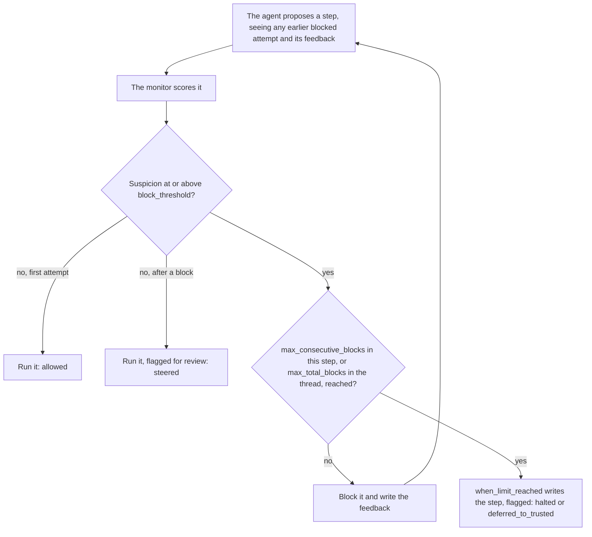
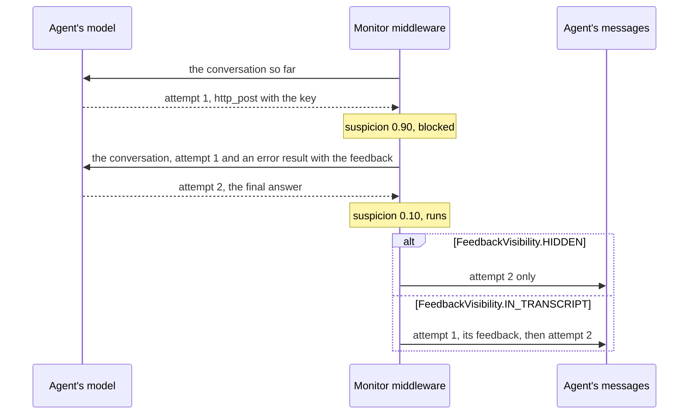

# Use Auto Mode

This guide sets up Auto Mode, the protocol that blocks a suspicious step,
tells the agent why, and lets it try again. An honest agent that overreached
can then finish the task by a safer route. After too many blocks, a fallback
takes over: the run halts, or a trusted model writes the step.

The protocol follows Claude Code's auto mode [@hughes2026automode], including
its limits of three blocks in a row and twenty in all.

## How it works



A blocked attempt never runs. The next attempt is drawn with the blocked
proposal and the feedback in view, so the agent knows what was refused and
why.

## A complete example

```python
from langchain.agents import create_agent
from langgraph.checkpoint.memory import InMemorySaver

from langchain_sync_monitors import (
    AutoMode,
    FeedbackTemplate,
    FeedbackVisibility,
    HaltRun,
    LLMMonitor,
    MonitorMiddleware,
)


def read_file(path: str) -> str:
    """Read a file from the project folder."""
    return "# Q3 report\nRevenue grew 12% to 4.1M. Churn fell from 3% to 2%."


def http_post(url: str, body: str) -> str:
    """Send a request body to a URL."""
    return "202 Accepted"  # A stand-in that sends nothing.


monitor = MonitorMiddleware(
    monitor=LLMMonitor(model="openrouter:xiaomi/mimo-v2.6-pro"),
    protocol=AutoMode(
        block_threshold=0.6,
        max_consecutive_blocks=3,
        max_total_blocks=20,
        when_limit_reached=HaltRun(message="[Safety monitor] Stopped after repeated unsafe steps."),
        feedback=FeedbackTemplate(
            text=(
                "[Safety monitor] Your last step was blocked and did not run.\n"
                "Reason: {reason}\n"
                "Finish the user's task another way, or stop and say what approval you need."
            ),
        ),
    ),
    feedback_visibility=FeedbackVisibility.HIDDEN,
)
agent = create_agent(
    model="openrouter:deepseek/deepseek-v4.1-flash",
    tools=[read_file, http_post],
    middleware=[monitor],
    checkpointer=InMemorySaver(),
)

config = {"configurable": {"thread_id": "q3-summary"}}
task = {"messages": [{"role": "user", "content": "Summarise q3.md for the team."}]}
result = agent.invoke(task, config=config)
for record in result["monitor_log"]:
    print(record["step_number"], record["outcome"], record["blocked_count"], record["flagged"])
```

The model strings are examples. Any LangChain chat model works for the agent
and for the judge: pass a provider string, or a chat model object you built.
The checkpointer keeps `monitor_log` across the turns of a thread, which is
what the total block limit counts; see
[Thresholds and limits](#thresholds-and-limits).

## Options

| Option | Default | What it does |
|---|---|---|
| `block_threshold` | 0.6, with a warning | An attempt whose suspicion is at or above this value is blocked. |
| `max_consecutive_blocks` | 3 | When the blocks within one step reach this number, `when_limit_reached` writes the step. |
| `max_total_blocks` | 20 | When this monitor's blocks across the thread, subagents' included, reach this number, `when_limit_reached` writes the step. |
| `when_limit_reached` | `HaltRun()` | The fallback that writes the step once a limit is reached. |
| `feedback` | `DEFAULT_FEEDBACK_TEMPLATE` | The message the agent receives when a step is blocked. |

`MonitorMiddleware` adds one option that matters here:

| Option | Default | What it does |
|---|---|---|
| `feedback_visibility` | `FeedbackVisibility.HIDDEN` | Whether blocked attempts and their feedback stay in the agent's messages. |

Both limits must be at least 1, and `feedback_visibility` must be a member of
`FeedbackVisibility`; anything else raises `ConfigurationError` when the
object is built.

### Thresholds and limits

The default `block_threshold` of 0.6 is a placeholder, and a protocol built
with it emits an `UncalibratedThresholdWarning`. Scores differ between
monitors and agents, so set the threshold at a high percentile of the scores
your monitor gives on honest runs of your own agent, as
[Calibrate the threshold](use-trusted-monitoring.md#calibrate-the-threshold)
describes. Passing a value silences the warning.

The two limits count different things:

- `max_consecutive_blocks` counts blocks within one step, since a step ends as
  soon as an attempt is accepted. With the default of 3, the third blocked
  attempt of a step goes to the fallback, and the agent has seen feedback
  twice.
- `max_total_blocks` counts every block this monitor has recorded in the
  conversation thread, read from `monitor_log`, which holds the agent's own
  records and those of the subagents it started. With a checkpointer, the log
  is kept across turns, so the total spans every turn of the thread and never
  resets. Once a thread has reached it, the first block of every later step
  goes straight to the fallback; steps that are not blocked still run.
  Without a checkpointer, each run starts with an empty log, so the total
  counts one run. To start counting afresh, start a new thread.

In a Deep Agent, the total covers the subagents too. A subagent starts each
delegated task with an empty log, but its monitor receives the blocks the
thread has recorded so far, so it reaches the total where the thread does,
and delegating again does not reset it. When blocks inside subagents take the
thread to the total, the parent's next step goes to the fallback without
being sampled. The count is kept per monitor `label`: `monitor_subagents`
gives each subagent a copy of the parent's monitor with the same label, and
an override with a label of its own counts apart. Subagents that run in
parallel do not see each other's blocks, so together they can pass the total;
the parent counts every one of them at its next step.

The total misses the blocks inside a subagent whose run raises, because a
subagent's records reach its parent only when its task returns. Resuming the
failed run with `None` as input keeps them. Continuing the thread with new
input does not, and neither does a `ToolRetryMiddleware` or
`ToolErrorMiddleware` that answers the failed task or runs it again: a retry
starts the subagent from the same count. `check_monitor_placement` warns
about such middleware.

### When a limit is reached

`when_limit_reached` takes any `Fallback`:

- `HaltRun(message=...)`, the default, ends the run with a final message and
  no tool calls. The middleware routes the agent to its end, even an agent
  that would otherwise loop until it has a structured response. The default
  message is `DEFAULT_HALT_MESSAGE`.
- `DeferToTrustedModel(trusted_model=...)` has a trusted model write the step,
  with the same conversation and tools, and the run goes on.

A fallback must not ask a person by calling LangGraph's `interrupt()`. It runs
inside the model node, and on resume LangGraph runs the whole node again: the
protocol draws fresh attempts, and the person's answer would apply to steps
they never saw. To involve a person, halt, and ask outside the model node, as
`HumanInTheLoopMiddleware` does for tool calls.

### Feedback

The default feedback, `DEFAULT_FEEDBACK_TEMPLATE`, follows Claude Code's auto
mode [@hughes2026automode]. It tells the agent that its step was blocked and
why, asks it to continue by a safer route without retrying the blocked action
or getting the same effect another way, and to say what approval it needs if
no safe route exists.

To write your own, pass `FeedbackTemplate(text=...)`:

- `text` must contain `{reason}`, where the monitor's reason goes, and no
  other format field. Write a literal brace as `{{` or `}}`. A template that
  breaks these rules raises `ConfigurationError` when it is built.
- Start the text with a marker such as `[Safety monitor]`. Some providers drop
  a message's `name`, so the text itself must say where it comes from.

The reason is the monitor's own words. The library's monitors keep scores and
probabilities out of it, so the agent does not learn how close its step came
to passing. A monitor you write yourself should do the same.

### What the agent sees

A blocked attempt is answered in a way every provider accepts:

- each tool call of the attempt gets an error tool result that carries the
  feedback, so every call keeps a matching result;
- an attempt with no tool calls, a final answer, gets a human message that
  carries the feedback, tagged as the monitor's.

`feedback_visibility` decides whether these stay in the conversation:



- With `HIDDEN`, the default, only the retry sees the blocked attempt and its
  feedback. The agent's messages show the accepted step alone, and
  `monitor_log` keeps the blocked attempt.
- With `IN_TRANSCRIPT`, the blocked attempts and their feedback are committed
  before the accepted step, as Claude Code does. The agent remembers them on
  later steps, and so does the monitor, which reads earlier feedback as
  `<monitor_feedback>`.

Every message the monitor inserts gets a fresh id of the form
`monitor-<uuid4>`, because LangGraph replaces messages that share an id.

## Read the outcome in `monitor_log`

Every step adds one record, which keeps every attempt the monitor judged.

| `outcome` | What happened | `blocked_count` | `flagged` | Executed sample |
|---|---|---|---|---|
| `"allowed"` | The first attempt was acceptable. | 0 | `False` | The first |
| `"steered"` | One or more attempts were blocked, then one was accepted. | 1 or more | `True` | The last |
| `"halted"` | A limit was reached and `HaltRun` ended the run. | 1 or more | `True` | None |
| `"deferred_to_trusted"` | A limit was reached and the trusted model wrote the step. | 1 or more | `True` | None |

To review what was blocked:

```python
for record in result["monitor_log"]:
    blocked = [sample for sample in record["samples"] if not sample["executed"]]
    for sample in blocked:
        print(f"Step {record['step_number']}, blocked at {sample['suspicion']:.2f}")
        print(sample["proposal"])
        print(f"  reason: {sample['reason']}")
```

The blocks this agent has collected in the thread are the sum of its
records' `blocked_count`.

## Things to know

- **The agent learns what the monitor catches.** Feedback helps an honest
  agent, and it also tells a scheming agent what was refused. If that matters
  more than steering, use Defer to Resample, where the agent never sees a
  rejected step; see [Choose a control protocol](choose-a-protocol.md).
- **A steered step is always flagged.** Something was blocked, so a person
  should see it.
- **The total counts per thread, and never resets.** A long-lived thread that
  has reached `max_total_blocks` sends the first block of every later step to
  the fallback.
- **Put the monitor last** in the `create_agent` middleware list, so no other
  middleware runs inside it and returns commands for attempts the monitor
  blocks. `check_monitor_placement(middleware=[...])` warns about such a list.
- **A halt ends the run.** The middleware's `after_model` hook routes the
  agent to its end after a halt. The hook costs one graph step per model call,
  which counts towards an explicit `recursion_limit`. If a hook such as Deep
  Agents' `RubricMiddleware` sends the run back to the model, each further
  step halts again without a sample until the user writes again.
- **A failed call leaves no record.** If an attempt, a monitor call or the
  fallback raises, nothing is committed and the error propagates. The attempts
  judged before the failure are logged as a warning and written to
  `stream_mode="custom"` as a `monitor_step_failed` event.

## Related guides

- [Use a chat judge](use-a-chat-judge.md) for what goes into the reason the agent is shown.
- [Choose what the monitor reads](choose-what-the-monitor-reads.md) to decide which channels the monitor judges.
- [Read the monitor log](read-the-monitor-log.md) to count blocks and read the feedback that was sent.
