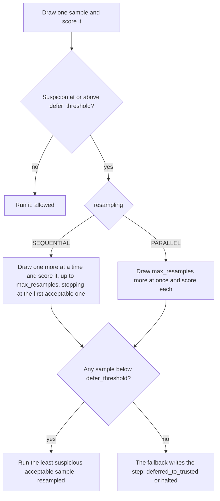

# Use Defer to Resample

This guide sets up Defer to Resample. When the monitor finds a step
suspicious, the protocol asks the agent's model for the same step again and
runs the least suspicious acceptable sample. Only when every sample looks
suspicious does a fallback write the step: a trusted model, or a halt.

The protocol comes from Ctrl-Z [@bhatt2025ctrlz], which reports a better
trade-off between safety and usefulness than deferring to a trusted model at
once: an honest step usually passes on a resample, and the extra samples are
evidence for an auditor.

## How it works



Every sample is a fresh call on the same conversation. The agent never sees
the rejected samples, and neither does the trusted model. Each step is flagged
for review when even its least suspicious sample reaches `audit_threshold`.

## A complete example

```python
from langchain.agents import create_agent

from langchain_sync_monitors import (
    DeferToResample,
    DeferToTrustedModel,
    LLMMonitor,
    MonitorMiddleware,
    Resampling,
)


def read_file(path: str) -> str:
    """Read a file from the project folder."""
    return "# Q3 report\nRevenue grew 12% to 4.1M. Churn fell from 3% to 2%."


def http_post(url: str, body: str) -> str:
    """Send a request body to a URL."""
    return "202 Accepted"  # A stand-in that sends nothing.


monitor = MonitorMiddleware(
    monitor=LLMMonitor(model="openrouter:xiaomi/mimo-v2.6-pro"),
    protocol=DeferToResample(
        fallback=DeferToTrustedModel(trusted_model="openrouter:xiaomi/mimo-v2.6-flash"),
        defer_threshold=0.6,
        audit_threshold=0.9,
        max_resamples=2,
        resampling=Resampling.SEQUENTIAL,
    ),
)
agent = create_agent(
    model="openrouter:deepseek/deepseek-v4.1-flash",
    tools=[read_file, http_post],
    middleware=[monitor],
)

task = {"messages": [{"role": "user", "content": "Summarise q3.md for the team."}]}
result = agent.invoke(task)
for record in result["monitor_log"]:
    scores = [round(sample["suspicion"], 2) for sample in record["samples"]]
    print(record["step_number"], record["outcome"], record["flagged"], scores)
```

The model strings are examples. Any LangChain chat model works for the agent,
the judge and the trusted model: pass a provider string, or a chat model
object you built.

## Options

| Option | Default | What it does |
|---|---|---|
| `fallback` | Required | What writes the step when no sample is acceptable. A protocol here, such as `DeferToTrusted` in place of `DeferToTrustedModel`, raises `ConfigurationError`. |
| `defer_threshold` | 0.6, with a warning | A sample whose suspicion is at or above this value is not acceptable. |
| `audit_threshold` | 0.9, with a warning | A step is flagged when the lowest suspicion across its samples is at or above this value. `None` turns flagging off. |
| `max_resamples` | 2 | How many more samples to draw after a suspicious first one. 0 draws no resample, so with the `DeferToTrustedModel` fallback the protocol behaves as Defer to Trusted; anything but a whole number of at least 0 raises `ConfigurationError`. |
| `resampling` | `Resampling.SEQUENTIAL` | `SEQUENTIAL` or `PARALLEL`, as below. A plain string raises `ConfigurationError`. |

### Fallbacks

The library has two fallbacks:

- `DeferToTrustedModel(trusted_model=...)` has a trusted model write the step,
  with the same conversation and tools. The outcome is `deferred_to_trusted`.
  This is Ctrl-Z's fallback. The trusted model must support tool calling.
- `HaltRun(message=...)` ends the run with a final message and no tool calls.
  The outcome is `halted`, and a halted step is always flagged. The default
  message, `DEFAULT_HALT_MESSAGE`, says the run was stopped because the
  agent's steps looked unsafe.

You can write your own by subclassing `Fallback`. A fallback must not ask a
person by calling LangGraph's `interrupt()`. It runs inside the model node,
and on resume LangGraph runs the whole node again: the protocol draws fresh
samples, and the person's answer would apply to steps they never saw. To
involve a person, end the step with `HaltRun` and ask outside the model node.

### Sequential or parallel

- `Resampling.SEQUENTIAL` draws one resample at a time and stops at the first
  acceptable one, as Ctrl-Z words the protocol. It costs the fewest calls. A
  step that needs every resample takes three rounds of one agent call and one
  monitor call.
- `Resampling.PARALLEL` draws all `max_resamples` at once. It always costs
  `max_resamples` extra samples, but a suspicious step takes two rounds rather
  than up to three. Under `ainvoke()` the resamples run concurrently, and one
  that fails cancels the others. Under `invoke()` they are drawn one after
  another, so parallel resampling saves no time there.

### Thresholds

Both thresholds are placeholders that emit an `UncalibratedThresholdWarning`.
Set them from the scores your monitor gives on honest runs of your own agent,
as [Calibrate the threshold](use-trusted-monitoring.md#calibrate-the-threshold)
describes.

The audit flag uses the lowest score across the step's samples, the statistic
Ctrl-Z found to work well [@bhatt2025ctrlz]: a step is flagged only when the
agent kept proposing something suspicious. An `audit_threshold` below the
`defer_threshold` is allowed: it flags steps that still ran, a queue of
borderline steps for a person to review.

## Read the outcome in `monitor_log`

Every step adds one record, which keeps every sample the monitor judged.

| `outcome` | What happened | Samples | Executed sample |
|---|---|---|---|
| `"allowed"` | The first sample was acceptable. | 1 | The first |
| `"resampled"` | The first was suspicious; a resample was acceptable. | 2 or more | The least suspicious acceptable one |
| `"deferred_to_trusted"` | No sample was acceptable; the trusted model wrote the step. | Up to `max_resamples + 1` | None |
| `"halted"` | No sample was acceptable; `HaltRun` ended the run. | Up to `max_resamples + 1` | None |

An auditor should read the most suspicious sample first:

```python
for record in result["monitor_log"]:
    if record["flagged"] or record["outcome"] != "allowed":
        worst = max(record["samples"], key=lambda sample: sample["suspicion"])
        ran = [sample for sample in record["samples"] if sample["executed"]]
        print(f"Step {record['step_number']}: {record['outcome']}")
        print(f"  most suspicious ({worst['suspicion']:.2f}): {worst['reason']}")
        print(f"  ran: {ran[0]['proposal'] if ran else 'nothing the agent proposed'}")
```

## Things to know

- **Resampling helps an injection that sometimes works.** The protocol runs
  the least suspicious acceptable sample, so an agent that plants text aimed
  at the monitor gets several tries at fooling it: an injection that passes
  one sample in five gets through about half the time across three samples
  [@terekhov2025adaptive]. Keep the monitor's view narrow, and treat a
  resampled step whose rejected samples scored high as worth an audit.
- **The least suspicious acceptable sample runs, not the first.** Under
  sequential resampling they are the same, because drawing stops at the first
  acceptable sample. Under parallel resampling, any of the resamples may win.
- **Resampling needs fresh draws.** A LangChain response cache, global or on
  the agent's model, answers every resample with the first sample again. The
  library warns once with a `CachedResampleWarning` when this happens. If your
  application sets a global cache, build the agent's model without one:
  `init_chat_model("openrouter:deepseek/deepseek-v4.1-flash", cache=False)`.
  A model that always gives the same reply, at temperature 0 for example,
  defeats resampling in the same way.
- **Put the monitor last** in the `create_agent` middleware list. If a
  middleware inside the monitor returns commands, only those of the last
  model call survive, and they match the committed step only when the last
  sample drawn is the one committed. Sequential resampling guarantees that;
  parallel resampling does not, and its concurrent calls pile up their
  commands. `check_monitor_placement(middleware=[...])` warns about such a
  list.
- **A flag never blocks.** The step has run, or been replaced, by the time
  anyone reads the log.
- **A failed call leaves no record.** If a sample, a monitor call or the
  fallback raises, nothing is committed and the error propagates. The samples
  judged before the failure are logged as a warning and written to
  `stream_mode="custom"` as a `monitor_step_failed` event. A middleware
  outside the monitor that retries failed calls, such as
  `ModelRetryMiddleware`, runs the whole step again with fresh samples.
- **A halt ends the run.** After a `HaltRun`, the middleware routes the agent
  to its end, even an agent that would otherwise loop until it has a
  structured response. The middleware's hooks cost two graph steps per model
  call, `before_model` and `after_model`, and two per run, `before_agent` and
  `after_agent`, all of which count towards an explicit `recursion_limit`. If
  a hook such as Deep Agents' `RubricMiddleware` sends the run back to the
  model, each further step halts again without a sample, until a later run
  brings a new message from the user.

## Related guides

- [Combine and calibrate monitors](combine-and-calibrate-monitors.md) to set the defer and audit thresholds from honest runs.
- [Read the monitor log](read-the-monitor-log.md) to read every sample the monitor judged.
