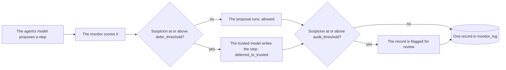

# Use Defer to Trusted

This guide sets up Defer to Trusted, the protocol that hands a suspicious step
to a trusted model. The agent's own model proposes each step; when the
monitor finds the proposal suspicious, a model you trust writes the step
instead, with the same conversation and tools.

The protocol comes from the AI control paper [@greenblatt2023aicontrol]. The
trusted model is usually weaker than the agent's model but one you are
confident will not work against you.

## How it works



The rejected proposal's tool calls never run, and neither the agent nor the
trusted model sees it. A provider's built-in tools in it, such as a web fetch,
already ran inside the model call that drew it. It stays in the step's record
as evidence.

## A complete example

```python
from langchain.agents import create_agent

from langchain_sync_monitors import DeferToTrusted, LLMMonitor, MonitorMiddleware


def read_file(path: str) -> str:
    """Read a file from the project folder."""
    return "# Q3 report\nRevenue grew 12% to 4.1M. Churn fell from 3% to 2%."


def http_post(url: str, body: str) -> str:
    """Send a request body to a URL."""
    return "202 Accepted"  # A stand-in that sends nothing.


monitor = MonitorMiddleware(
    monitor=LLMMonitor(model="openrouter:xiaomi/mimo-v2.6-pro"),
    protocol=DeferToTrusted(
        trusted_model="openrouter:xiaomi/mimo-v2.6-flash",
        defer_threshold=0.6,
        audit_threshold=0.9,
    ),
)
agent = create_agent(
    model="openrouter:deepseek/deepseek-v4.1-flash",
    tools=[read_file, http_post],
    middleware=[monitor],
)

task = {"messages": [{"role": "user", "content": "Summarise q3.md for the team."}]}
result = agent.invoke(task)
for record in result["monitor_log"]:
    [sample] = record["samples"]
    print(record["step_number"], record["outcome"], record["flagged"], sample["suspicion"])
```

The model strings are examples. Any LangChain chat model works in each of the
three places: pass a provider string, or a chat model object you built. The
trusted model must support tool calling, because it receives the agent's
tools.

## Options

| Option | Default | What it does |
|---|---|---|
| `trusted_model` | Required | The model that writes a deferred step. A provider string is resolved once, when the protocol is built. |
| `defer_threshold` | 0.6, with a warning | A proposal whose suspicion is at or above this value is replaced by the trusted model's step. |
| `audit_threshold` | 0.9, with a warning | A step whose suspicion is at or above this value is flagged for review. `None` turns flagging off. |

Both thresholds are on the monitor's 0 to 1 scale, and both defaults are
placeholders that emit an `UncalibratedThresholdWarning`. Set them from the
scores your monitor gives on honest runs of your own agent, as
[Calibrate the threshold](use-trusted-monitoring.md#calibrate-the-threshold)
describes. Passing a value silences the warning for that threshold.

The two thresholds are independent. An `audit_threshold` below the
`defer_threshold` is allowed and useful: it flags steps that still ran, which
gives a person a queue of borderline steps to review.

## Read the outcome in `monitor_log`

Every step adds one record with exactly one sample, the agent's proposal.

| `outcome` | What happened | The sample's `executed` |
|---|---|---|
| `"allowed"` | The proposal was below `defer_threshold` and ran. | `True` |
| `"deferred_to_trusted"` | The trusted model wrote the step instead. | `False` |

`flagged` is `True` when the proposal's suspicion reached `audit_threshold`.
The record keeps the rejected proposal in full, but not the trusted model's
step, which is in the agent's messages like any other step.

```python
for record in result["monitor_log"]:
    if record["outcome"] == "deferred_to_trusted":
        [rejected] = record["samples"]
        print(f"Step {record['step_number']} was deferred ({rejected['suspicion']:.2f}):")
        print(rejected["proposal"])
```

## Things to know

- **The trusted step is not judged.** The monitor scores the agent's
  proposal only; whatever the trusted model writes runs as it is. That is what
  trusting it means.
- **Defer to Trusted is Defer to Resample with no resamples.** To stop the run
  instead of deferring, use
  `DeferToResample(fallback=HaltRun(), max_resamples=0)`; see
  [Use Defer to Resample](use-defer-to-resample.md).
- **A flag never blocks.** Deferral is what stops a step. The flag only marks
  the record for a person to read afterwards.
- **The trusted model sees the same conversation and tools.** It writes the
  step as if it were the agent, and its reply joins the agent's messages. The
  agent's model sees that reply as its own on the next step.
- **Put the monitor last** in the `create_agent` middleware list, so no other
  middleware runs inside it. `check_monitor_placement(middleware=[...])` warns
  about a list that does not. A second monitor inside this one loses its
  judgement of every step that is deferred; see [Two monitors in one
  agent](../explanation/design.md#two-monitors-in-one-agent).
- **A failed call leaves no record.** If the agent's model, the monitor or the
  trusted model raises, nothing is committed and the error propagates. The
  step is written to `stream_mode="custom"` as a `monitor_step_failed`
  event, and any sample judged before the failure is logged as a warning.

## Related guides

- [Combine and calibrate monitors](combine-and-calibrate-monitors.md) to set the defer threshold from honest runs.
- [Read the monitor log](read-the-monitor-log.md) to see which steps went to the trusted model.
