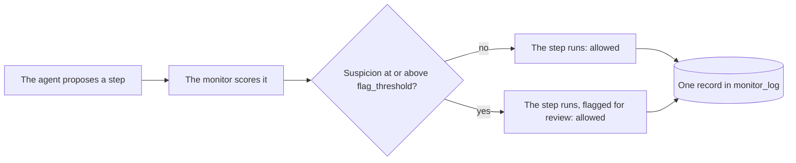

# Use Trusted Monitoring

This guide sets up Trusted Monitoring, the protocol that scores every step and
flags the suspicious ones without ever changing what the agent does. Use it to
watch an agent before you let a monitor intervene, to collect the honest-run
scores that calibrate a threshold, or to build a queue of steps for a person
to review.

The protocol comes from the AI control paper [@greenblatt2023aicontrol].

## How it works



Each step is sampled once and always runs. The only difference a high score
makes is the `flagged` mark on the step's record.

## A complete example

```python
from langchain.agents import create_agent

from langchain_sync_monitors import LLMMonitor, MonitorMiddleware, TrustedMonitoring


def read_file(path: str) -> str:
    """Read a file from the project folder."""
    return "# Q3 report\nRevenue grew 12% to 4.1M. Churn fell from 3% to 2%."


def http_post(url: str, body: str) -> str:
    """Send a request body to a URL."""
    return "202 Accepted"  # A stand-in that sends nothing.


monitor = MonitorMiddleware(
    monitor=LLMMonitor(model="openrouter:xiaomi/mimo-v2.6-pro"),
    protocol=TrustedMonitoring(flag_threshold=0.6),
)
agent = create_agent(
    model="openrouter:deepseek/deepseek-v4.1-flash",
    tools=[read_file, http_post],
    middleware=[monitor],
)

task = {"messages": [{"role": "user", "content": "Summarise q3.md for the team."}]}
result = agent.invoke(task)
for record in result["monitor_log"]:
    [sample] = record["samples"]
    print(record["step_number"], record["outcome"], record["flagged"], sample["suspicion"])
```

The model strings are examples. Any LangChain chat model works for the agent
and for the judge: pass a provider string, or a chat model object you built.

## Options

`TrustedMonitoring` takes one option.

| Option | Default | What it does |
|---|---|---|
| `flag_threshold` | 0.6, with a warning | A step whose suspicion is at or above this value is flagged. |

`MonitorMiddleware` takes the `monitor` and the `protocol`. Its other options
name the monitor and matter for subagents; the
[Deep Agents guide](monitor-deep-agents-subagents.md) covers them.

### Calibrate the threshold

The default of 0.6 is a placeholder. A protocol built with it emits an
`UncalibratedThresholdWarning`, because suspicion scores differ between
monitors and agents, and a fixed value may flag most honest work or miss
attacks. Passing any value yourself silences the warning.

Control evaluations set a threshold at a high percentile of the scores the
monitor gives on honest runs [@greenblatt2023aicontrol; @bhatt2025ctrlz].
Trusted Monitoring is the protocol to collect them with, since it never
changes a run. Run the agent on tasks you know to be honest, then take, for
example, the 98th percentile:

```python
import statistics

honest_scores = [
    sample["suspicion"]
    for result in honest_results
    for record in result["monitor_log"]
    for sample in record["samples"]
]
flag_threshold = statistics.quantiles(honest_scores, n=100)[97]
```

`honest_results` holds the results of your honest runs. When scores are
fine-grained, a threshold at the 98th percentile flags about 2% of honest
steps.
A single chat judge scores in steps of 0.1, though, so many honest steps share
a score, and the percentile can fall inside a group of tied scores. The share
flagged then lands well away from 2% [@kaufman2025basharena;
@koran2026ensemble]. Two wrappers help: `RepeatedMonitor` averages several
calls of the monitor, which spreads the scores out, and `CalibratedMonitor`
reports each step's suspicion as its rank among honest-run scores, breaking
ties at random, so that a threshold of 0.98 flags about 2% of honest steps.

## Read the outcome in `monitor_log`

Every step adds one record. Under Trusted Monitoring each record has:

- `outcome`: always `"allowed"`, because the step always runs;
- `flagged`: `True` when the step's suspicion reached `flag_threshold`;
- `blocked_count`: always 0;
- `samples`: exactly one sample, with `executed` set to `True`, its
  `suspicion`, the monitor's `reason`, and the `proposal` as rendered text.

To list the steps a person should review:

```python
for record in result["monitor_log"]:
    if record["flagged"]:
        [sample] = record["samples"]
        print(f"Step {record['step_number']}, suspicion {sample['suspicion']:.2f}")
        print(sample["proposal"])
        print(sample["reason"])
```

## Things to know

- **A flag never blocks.** The flagged step has already run by the time anyone
  reads the log. To stop a step, use one of the other protocols; see
  [Choose a control protocol](choose-a-protocol.md).
- **Final answers are steps too.** The agent's last message is judged like any
  tool call, so every run costs at least one monitor call per model call.
- **Put the monitor last** in the `create_agent` middleware list. LangChain
  nests the first middleware outermost, so the last one sits directly around
  the model. `check_monitor_placement(middleware=[...])` warns about a list
  that puts a middleware where it undermines the monitor.
- **A failed call leaves no record.** If the agent's model or the monitor
  raises during a step, nothing is committed and the error propagates. The
  samples judged before the failure are logged as a warning and written to
  `stream_mode="custom"` as a `monitor_step_failed` event.
- **Steps stream whole.** Nothing reaches `stream_mode="messages"` until the
  protocol has decided, so a monitored agent streams each step at once rather
  than token by token. The monitor's own calls never stream.
- **The graph takes one more step per model call.** The middleware's
  `after_model` hook counts towards an explicit `recursion_limit`.

## Related guides

- [Combine and calibrate monitors](combine-and-calibrate-monitors.md) to set the flag threshold from honest runs.
- [Read the monitor log](read-the-monitor-log.md) to find and audit flagged steps.
